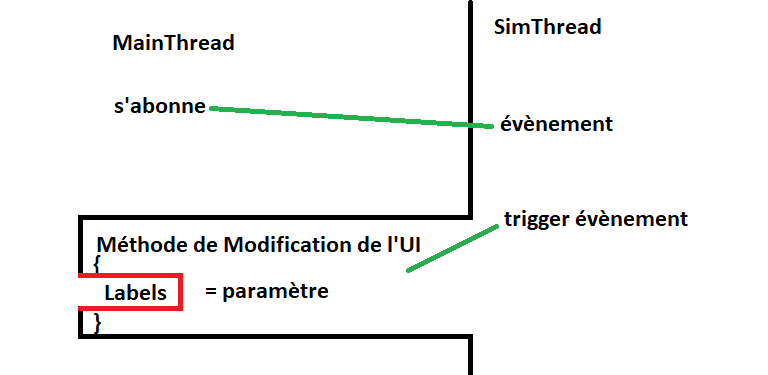

# LogBook
| Auteur | Date de début | Projet  | Description | Communication |
| ------------- |:-------------:| :-----|---|---|
| Joey Martig| 19.04.2021 | Travail de diplome Covid propagation | Applications permettant de voir l'évolution d'un virus dans un environnement peuplé d'individus. | Joey.mrtg@eduge.ch Joey.mrtg@gmail.com |

# 19.04.2021 - 08h05/17h00
- Rendu appréciation du travail de stage.
- Démarrage du travail de diplôme et présentation moodle.
- Documentation
  - Intégration CDC
  - Introduction
  - Résumé
  - Planning prévisionnel
- Comparaison WPF et winforms
  - [Référence 1](https://www.c-sharpcorner.com/article/wpf-vs-winforms/#:~:text=The%20abbreviation%20W.P.F%20simply%20refers,to%20develop%20Windows%20desktop%20applications.)
    - Peu de différence autre que la structure
    - WPF semble plus récent et puissant
  - [Référence 2](https://www.wpf-tutorial.com/about-wpf/wpf-vs-winforms/)
    - Interface GUI plus performante (très intéressant)
    - Plus récent (Plus de librairies mises à jour)
  - [Référence 3](https://www.educba.com/winforms-vs-wpf/)
    - WPF est plus rapide
    - Aussi plus complexe
  - [Référence 4](https://stackoverflow.com/questions/31154338/windows-forms-vs-wpf)
    - Les deux se valent
    - WPF est meilleur pour les UI
    - WPF n'est pas disponible pour linux et mac
    - Le data binding est meilleur en WPF ainsi que le design
  - Conclusion
    - L'apprentissage de la structure WPF va prendre du temps, mais semble en valoir la peine.
    - L'UI sera plus belle et simple à réaliser en WPF
    - Le plus gros avantage semble être BEAUCOUP plus efficace pour l'affichage de l'interface graphique me permettant d'utiliser le GPU à pleine puissance contrairement au winform qui ne l'utilise pas. Sachant que les pc sont équipés de gtx 1060, le changement en WPF semble être le meilleur choix.
    - WPF semble donc être le meilleur choix.
  - Une autre alternative à l'utilisation de l'interface graphique de WPF est Unity qui peut être intégré et communiquer avec le projet. [Intégration d'Unity en WPF](https://stackoverflow.com/questions/44059182/embed-unity3d-app-inside-wpf-application). [Communication](https://www.youtube.com/watch?v=rz6MNZMyza4). [Génération dynamique](https://www.youtube.com/watch?v=8eTWq27h4sY)
  - Unity semble être une bonne idée cependant, dans mon cas, en prenant en compte le nombre d'appelle, utiliser Unity et faire communiquer les deux projets me semblent trop compliqué. Peut-être que rester sur WPF est plus sûr.
- Documentation
  - Analyse interface graphique
    - Comparaison WPF - WinForms - Unity
    - Choix de technologie
- Tentative de communication réussie à l'aide de ce [tutoriel](https://www.youtube.com/watch?v=rz6MNZMyza4).
  - Inutilisable pour ce projet, car la communication est trop restreinte.
  - La communication se fait uniquement avec des string ou des images, mais pas d'objets c#.
- Tentative d'intégration d'Unity dans un projet WPF
  - Réussi
  - Problème de resize
    - Au lancement prend toute la fenêtre
    - Le resize et positionnement fonctionnent
    - À la fermeture du programme, Unity ne s'arrêtait pas et utilisait 15% du processeur à chaque ouverture.

# 20.04.2021 - 08h05/17h00
- Rétrospective 19.04.2021
- Recherche des méthodes dans la dll user32.dll
- Recherche de différents moyens de communication entre WPF et Unity
  - Essai d'envois de données de WPF à Unity avec un pipeline anonyme
  - Essai d'envois de données de WPF à Unity avec un pipeline nommé
    - Réussi entre Unity et WPF, mais inutilisable actuellement
    - Il faut stopper le programme pour lire le message
    - Peut-être un problème lié au fait que les deux programmes essaient de lire au même moment.

- Problèmes d'intelliSense sur Unity
  - la connexion entre le script vs 2019 et Unity n'est pas établie.
  - Mise à jour de vs 2019 et installation des paquets Unity
  - Redémarrage du pc
  - Modifications de paramètre Unity et vs sans succès
  - Recherche de solutions concernant vs 2019 et non 2015
  - Pas suffisant. Ne fonctionne toujours pas.
  - [Le point e. à reglé le problème](https://blog.terresquall.com/2020/11/fixing-visual-studios-intellisense-autocomplete-in-unity/)
- Problème avec Unity qui supprime mes objets à chaque fermeture du projet
  - La scène avait été supprimée et ne s'était pas rajoutée automatiquement
- Communication fonctionnelle, mais le projet Unity freeze après chaque message.
  - Tentative d'utilisation de l'asynchrone pour pallier au problème
    - Ce problème est réglé cependant un problème de décalage fait que WPF parle chinois.
    - 
    - Essai de lecture de byte pour obtenir le résultat. sans succès
    - Refactoring du code pour fonctionner en async.
    - Le code est toujours imparfait et décalé
      - "Test communication" => "Test communication"
      - "Test communication" => "est communication"
      - "Test communication" => Signes chinois
  - Communication en string fonctionnelle à 100% en utilisant une méthode async récursive appelée au démarrage du projet Unity.
    - Méthode appelée chaque seconde ayant des résultats très aléatoires.
    - 
    - Méthode appelée une fois au démarrage puis à chaque fois qu'elle termine l'affichage de données reçues.
    - 
  - Idée pour l'implémentation en Unity : Envoyer des objets en JSON via le pipeline.
  - Test d'envoi d'un objet de WPF à Unity en JSON
    - 
    - 

# 21.04.2021 - 08h05/17h00
- Documentation
  - Complétion de la comparaison de technologie d'interface graphique des pipelines.
  - Problèmes rencontrés - Pipelines
  - Intégration d'Unity à WPF
- Modification de l'envoi de données pour utiliser un BinaryWriter à la place d'une Stream
  - Augmente la limite de données transmissible d'un Uin16 à int32.
- Modification de la réception des données pour utiliser un BinaryReader à la place d'un stream.
- Test d'intégration + communication réussie
- Début de la création de l'UI
  - Recherche d'un thème pour l'application
    - [Thème prometteur](https://github.com/MaterialDesignInXAML/MaterialDesignInXamlToolkit)
    - Test du thème
    - Le thème fonctionne et possède énormément de possibilités
  - Test de différents composants du thème
  - Boutons
  - TabControl
    - Changement d'icônes
    - Changements de la couleur
    - Tentative de changer le background pour un background non prédéfini.
    - Intégration d'une autre page xaml depuis le TabControl
  - Création d'une page, pour la simulation, les paramètres graphiques et les paramètres de la simulation
  - Abandon du thème trouvé dû à son manque de responsivité malgré sa grande variété de contenu.

# 22.04.2021 - 08h05/17h00
- UI
  - Ajouts d'icône de boutons [Source](https://materialdesignicons.com/)
  - Création de l'interface principale
    - Menu
    - Sections
    - Responsivité
  - Utilisation des columns et rows
  - Impossible de changer la couleur de la barre de titre du projet
    - Désaffichage de la barre
    - Création de ma propre barre
    - Différence entre les deux versions
      - 
      - 
  - Modification des méthodes de la barre de titre pour être utilisable sur toutes les pages
  - Modification de la structure des boutons pour intégrer directement l'image dans leur balise et non appeler une image. La version précédente empêchait plusieurs boutons d'avoir la même image. Résultat en l'affichage de premier bouton sans image.
  - Création de différentes pages de contenus
  - Navigation entre les pages
  - Modification de l'affichage d'un slider
    - Difficulté à trouver les bons paramètres
    - Binding de la couleur à la valeur du slider
    - Création d'un template pour le slider en récupérant la version de base de  [WPF](https://docs.microsoft.com/en-us/dotnet/desktop/wpf/controls/slider-styles-and-templates?view=netframeworkdesktop-4.8)
    - Suppression de la track-bar
    - Modification du RepeatButton
      - Création de deux versions se situant à gauche et droit du thumb et ayant des couleurs différentes
    - Comparaison du slider de Windows et du slider personnalisé à l'aide d'un template
      - 
  - Modification de l'affichage des radioBoutons en récupérant la version de base de [WPF](https://docs.microsoft.com/en-us/dotnet/desktop/wpf/controls/radiobutton-styles-and-templates?redirectedfrom=MSDN&view=netframeworkdesktop-4.8)
    - Nouveau design 
    - 
  - Modification des couleurs pour qu'elles soient contenues dans des balisent facilement modifiable.
  - Modification de l'affichage des checkbox en récupérant la version de base de [WPF](https://docs.microsoft.com/en-us/dotnet/desktop/wpf/controls/checkbox-styles-and-templates?view=netframeworkdesktop-4.8)
    - Nouveau design 
    - 
- Modification de la fermeture des fenêtres pour cacher les fenêtres secondaires et fermer le programme en cas de fermeture de la fenêtre principale.

# 23.04.2021 - 08h05/16h10
- Documentation
  - Organisation
  - Maquettes
  - Introduction
    - Technologies utilisées
  - Schéma de fonctionnement
  - Description des technologies utilisées
- Réflexion sur le fonctionnement des threads pour l'application.
  - Parallel
- Installation LiveCharts
  - Installation packet LiveCharts
  - Installation packet LiveCharts.Wpf
  - Installation packet LiveCharts.Geared
- Graphiques
  - Bug à chaque changement de taille, régénérer la solution est nécessaire.
    - Uniquement dans le concepteur et non au lancement du programme
    - Nettoyer la solution permet de tout de même voir l'affichage de la fenêtre
  - Intégration de graphiques
    - Courbe
    - HeatMap
    - Colonne
    - Ligne
    - Bulle
    - Circulaire (Camembert)
    - Area Stack
    - 

# 26.04.2021 08h05 / 16h10
- Début de la création de la simulation
- Récupération du code du stage et suppression des éléments graphiques
- Commentaires
- Création d'une classe "Site" regroupant tous les lieux et véhicules
- Relecture du cahier des charges
- Relecture du fichier Excel contenant la transmission par aérosol [2021_COVID-19_Aerosol_Transmissionn_Estimator](https://docs.google.com/spreadsheets/d/1x_QFiFPbqLtZTjuoVoCyPQdu7onu6c370NNlPZ3TfTk/edit#gid=1679887415)
- Création du code des lieux en fonction du fichier Excel
  - Taille du bâtiment, longueur - largeur - hauteur - air - volume
  - Paramètres de l'air et de déposition
  - Utilisation du type double pour le calcul du taux d'infection
  - Suppression de certains paramètres non utilisés
- Réflexion sur la structure du code et l'interaction entre les individus et les lieux
  - Résistance au virus
    - Maladies
    - Âge
    - 
  - Création des plannings
    - Pattern
    - (Gérer les cercles sociaux)
    - Création en fonction de l'âge
    - 
  - Mesures & Symptômes
    - resistance
    - comportement
    - Augmentent certains paramètres
    - 
  - Les activités ne contiennent que des types d'objets permettant de définir ce que l'individu fait. Le planning contient les lieux et les indique à l'individu.
- Création des plannings en fonction de la figure concernant leur création.
- Nombre d'école et autres bâtiments en fonction du nombre de personnes. Genève servant d'exemple.
  - Formules  
    - 100 + Abs((y2 - y1) / y1)*100 = %
    - (% - 100)/100 * y1 + y1 = y2
  - ~0.033%  --> 165 écoles pour 500'000 personnes 100 + ((165 - 500'000) / 500'000)*100
  - ~6,74%  --> 33'700 entreprises pour 231'000 emplois
  - ~0.0016%  --> 8 hôpitaux, 2 cliniques, 30 lieux de soins
  - ~0,0272%  --> ~136 supermarchés
  - ~50% - 100%    --> ~250'000 appartements
- pareil, mais pour l'âge de la population
  - ~22% 0-19  ans
  - ~63% 20-64 ans
  - ~10% 65-79 ans
  - ~5%  80+   ans
  - [Source](https://www.ge.ch/statistique/graphiques/affichage.asp?filtreGraph=11_02&dom=1)
- Pareil pour les transports
  - ~36%  --> 218'000 voitures (Chauffeur ou passagers)
  - ~15%  --> 452 + 117 tpg
  - ~10%  --> ~ 200'000 vélos
  - [Source](https://www.letemps.ch/suisse/nombre-voitures-menage-diminue-geneve#:~:text=Au%20d%C3%A9but%20de%20l'ann%C3%A9e,augmentation%20de%206%2C5%25)
- Réflexion sur la création des transports et bâtiments et sur la source de certaines données.
  - On a une population de 100 personnes
    - 22% 0-19  ans
    - 63% 20-64 ans
    - 15% 65+ ans
  - Il faut donc au minimum 
    - Une école
    - Un supermarché
    - Une maison par personne (pour le moment les < 19 ans vivent seuls)
  - On crée les bâtiments en fonction des besoins cités
  - Pour les véhicules
    - On crée 36 voitures
    - et des bus (à voir plus tard pour la quantité)
  - Ensuite, on crée les 100 individus
    - En fonction du pourcentage d'âge
    - On leur attribue 
      - Une maison vide
      - Une école
      - Un moyen de transport (vide si voiture)
    - On créé leurs résistances

# 27.04.2021 08h05 / 16h30
- Les véhicules dans la simulation agissent exactement comme les bâtiments.
  - Pas de déplacements
  - La voiture étant la seule d'"unique" à une personne.
    - La différence réside dans l'assignation et non dans le fonctionnement.
- Suppression du parent "Vehicle" et "Building"
- Création d'un objet parent "Site" représentant tous les lieux, dont les véhicules et l'extérieur.
- Création de variables constantes globales pour la création des sites
- Réflexion sur le fonctionnement des individus
  - Marche à suivre.
  - Utiliser du async pour récupérer le taux de contamination ? (Attendre que tout le monde soit bien entré)
- Création des individus
  - Maladies
  - Résistance au virus
  - Durée de l'immunité
  - Durée de l'infection par le virus
- Création des maladies
  - Puissance
    - En fonction de l'âge
  - Durée
- Recherche de source pour gérer mathématiquement les probabilités qu'une personne attrape des maladies en fonction de son âge.
  - Meilleure compréhension du sujet, mais rien de concluant.
- Modification des namespace qui avaient automatiquement créé sous namespace en créant des dossiers dans le programme WPF
- Modification du site pour prendre en compte les personnes qui se trouvent dedans.
  - Cette modification impacte aussi à quel moment le calcul des probabilités est effectué.
  - Si une personne entre ou sort. Les probabilités sont recalculées.
  - Sinon on récupère la dernière valeur sans recalculer
  - Dois recalculer si une personne a été infectée. (en prenant en compte le temps d'incubation du virus, ce n'est pas probablement pas nécessaire.)
- Données récupérées concernant le temps d'incubation et d'infection du covid
  - [Durée du covid](https://www.cdc.gov/coronavirus/2019-ncov/if-you-are-sick/end-home-isolation.html#:~:text=You%20can%20be%20around%20others%20after%3A,of%20fever%2Dreducing%20medications%20and)
  - [Incubation et durée](https://patient.info/news-and-features/coronavirus-how-quickly-do-covid-19-symptoms-develop-and-how-long-do-they-last)
- Suppression des cercles familiaux et d'amis du planning
  - Raison :
    - Pas par manque de temps, mais par logique due au fonctionnement de la simulation
    - Les plannings gèrent entièrement la simulation, les lieux., les horaires, les contacts.
    - Au final, la famille sont les personnes habitant au même endroit. Les amis, les personnes qui vont aux mêmes bars.
    - La création du planning s'occupera donc de gérer les contacts proches
  - Cette modification pourrait être revue plus tard en fonction de l'évolution du fonctionnement de la simulation et des interactions entre les objets.
- Commentaires et création d'en-têtes dans le code
- Recherche de conversion de probabilité d'années en mois
  - Rien trouvé
  - Uniquement dans l'autre sens
- Est-il justifié d'avoir des symptômes de virus ?
  - La résistance au virus étant simplifié et l'accent étant majoritairement mis sur la propagation, elle-il nécessaire d'intégré des symptômes qui dans 90% des cas ne changent en rien le taux de contamination (excepté la toux donc).
  - Simplifier en utilisant simplement le taux de transmission ?
    - Pas viable, car asymptomatiques
  - Les symptômes pourraient être utilisés pour détecter le virus dans la simulation pour les quarantaines et autres.
  - Garder les symptômes, mais avec pour la majorité, uniquement un indice de détection
- Création de la classe Virus, Transmission et Symptom
- Création du fichier XML comportant les données du Covid
- Lecture du fichier depuis le code et récupération des données.
- Fonctionnement imaginé du virus et de ses composants
  - 
  - Informations importante concernant la respiration et affectant donc la toux [Source](https://docs.google.com/spreadsheets/d/1x_QFiFPbqLtZTjuoVoCyPQdu7onu6c370NNlPZ3TfTk/edit#gid=519189277)
    - Resting – Oral breathing = 2.0 quanta/h
    - Resting – Speaking = 9.4 quanta/h
    - Resting – Loudly speaking = 60.5 quanta/h
    - Standing – Oral breathing = 2.3 quanta/h
    - Standing – Speaking = 11.4 quanta/h
    - Standing – Loudly speaking = 65.1 quanta/h
    - Light exercise – Oral breathing = 5.6 quanta/h
    - Light exercise – Speaking = 26.3 quanta/h
    - Light exercise – Loudly speaking = 170 quanta/h
    - Heavy exercise – Oral breathing = 13.5 quanta/h
    - Heavy exercise – Speaking = 63.1 quanta/h
    - Heavy exercise – Loudly speaking = 408 quanta/h
- Modification de la transmission par aérosol sur les sites pour prendre en compte les paramètres individuels de chaque individu présent sur les lieux.

# 28.04.2021 07h50 / 17h00
- Refactoring
  - Certain point logiques à revoir
    - Le lieu calculait le risque de transmission aérosol alors que c'est au type de transmission du virus de le faire. Ou un mix des deux.
- Penser à modifier les calculs récupérés sur le fichier Excel pour être plus en accord avec le fonctionnement de la simulation.
- Revoir le pattern visistor pour éventuellement l'implémenter pour le calcul de risque de la transmission
- Transmission effectuée
  - Revoir la structure du code pour certaines améliorations nécessaires
- Ajout de données du covid dans le fichier Excel
- Refactorisation de la lecture du fichier XML
  - Échec
  - La structure de code essayée ne correspond pas aux besoins de la simulation
    - Tentative de conversion d'une boucle itérant dans le XML à un système de query. Cependant, les query ne permettent pas de récupérer des valeurs précisent en groupes et de les lire individuellement.
- Penser à remplacer le XML par du JSON.
  - Permettant de générer le virus de façon dynamique en fonction du JSON.
- Création du diagramme de classe
- Discussion avec M. Mathieu sur les threads de l'application
  - Création de 2 thread, un gérant la simulation, l'autre la GUI.
  - À la place d'un timer, vérifier le temps entre deux "tick" et attendre si le traitement est trop rapide.
  - 
- Création du "timer" dans la simulation
- lecture du code TrainSimulatorApp
  - Fonctionnement des Threads
  - Boucle
- Intégration de la simulation au programme WPF
  - Start
  - Stop
  - Changement de l'interval en fonction du slider
- Recherche sur le binding de données en WPF
  - Trop complexe pour le moment. À éventuellement ajouter plus tard.
- Création des bâtiments
  - Reprise de réel
- Perte du câble du disque dur externe --> pas de sauvegarde dessus
- Données concernant le nombre d'étudiants à Genève pour calculer le ratio école / élèves.
  - Total = 103'008 étudiants en 2020
  - [Sources](https://drive.google.com/drive/folders/16TU3wTAwMIrx5XxhLVHWT5VI7Rbx-zqy?usp=sharing)
- Rectification du compteur de bâtiment nécessaire à la population
  - Formules
    - (% - 100) / 100 * y1 + y1 = y2
    - 100 - ((y2 - y1) / y1) * 100 = %

# 29.04.2021 08h05 / 17h00
- Début de la création des plannings
  - Modification de la création des bâtiments
  - Ajouts des restaurants
  - Ajouts de l'extérieur
- Quantité de personne retraitée à Genève = ~14%
  - [Source](https://www.ge.ch/statistique/tel/publications/2016/donnees_generales/annuaire/dg_as_2016.pdf)
- Création de la structure du planning d'un individu qui travaille
  - Jour de travail :
```
  Home 5h-8h
  trajet (5h30 - 8h30)
  company (Arrivé 6h - 9h  Départ (11h-12h))
  trajet | company (11h30-12h30)
  Resto  | Company (Arrivé 12h - 13h  Départ (12h30-13h30))
  trajet | company (13h-14h)
  company (Arrivé 13h30-14h30  Départ (16h-19h))
  trajet (16h30 - 19h30)
  Supermarché 30m-1h30 | maison 30min-Fin | restaurant 1h-3h | Bar (17h-19h)
                      \ /                \ /                 | Bar
  Supermarché          | maison           | restaurant       | Bar (17h30-19h)
                      \                  \ /                 | Bar
                       | maison           | restaurant       | Bar (19h - 20h)
   Outisde             | maison                              | Bar (20h - minuit)
   maison
   ```
- Ajouts de méthode d'extensions pour le calcul de random booléen
  - Méthode choisissant un choix aléatoire entre plusieurs choix à disposition selon un poids
- ~~Création d'une méthode créant la soirée d'une personne de manière dynamique~~
  - ~~Manque de connaissance pour la réaliser de manière propre et fonctionnel~~
- Création de différents patterns préfaits choisis de manière aléatoire.
  - Simplifie la version précédente
  - Suffisamment aléatoire
- Utiliser une string en temps que seed pour générer des plannings ?
  -  +Meilleur contrôle sur les plannings
  -  +Simple
  -  +Possibilité d'ajouter une génération aléatoire plus tard
  -  -Prégénéré
  -  -durée des périodes (ne devraient pas changer)
- Création de la string
- Modification de l'emplacement des méthodes de création de planning.
  - CreateDays simulation --> Day
  - CreatePlanning simulation --> Planning
- Génération du planning en fonction de la seed
- Création de seeds pour étudiants, adultes et retraités
- Première compilation de la simulation (Alpha) réussie après quelques bugs mineurs
- Suppression des paramètres "Pression", "Temperature" et "Co2" dans les lieux, car pas encore utilisé par [](https://docs.google.com/spreadsheets/d/1x_QFiFPbqLtZTjuoVoCyPQdu7onu6c370NNlPZ3TfTk/edit#gid=519189277).

# 30.04.2021 08h05 / 17h00
- Documentation
  - ~~Revoir la structure pour fonctionner avec le système de sprint.~~
  - Réduction de la quantité de code affiché dans la documentation
  - Modification de l'agencement
  - Correction de l'orthographe
- Discussion avec M. Mathieu
  - Contenu du rapport
    - Pas de code
    - Pseudo-codes OK
    - Utiliser un "ID" sur le pseudo-code qui se retrouve dans les commentaires du code correspondant. Permets de retrouver rapidement.
  - Contenu du LogBook
  - Rendu Sprint 1
    - Uniquement le rapport
- Modification du diagramme de classe
- Avancement de l'interface graphique simulation
  - Ajout d'une barre de scroll
  - Ajouts d'éléments à l'emplacement des futurs éléments graphiques
  - Création d'une grille par le code
  - Création d'une méthode d'extension permettant de récupérer le dernier index d'une liste.
  - Ajouter / retirer colonnes et lignes responsives

# 03.05.2021 08h05 / 17h00
- Répartition des Site dans les plannings
  - Réflexion sur l'attribution des sites pour la famille et amis.
    - Attribution au préalable ?
    - ~~Attribution à chaque itération ?~~
    - ~~Mixe ?~~
  - 
  - Création de différents présets
  - [Source des données de répartition des ménages](https://www.ge.ch/statistique/tel/publications/2014/analyses/communications/an-cs-2014-48.pdf)
    - Graphique page 4
    - Graphique page 7
      - Original :
        - 
      - Version simplifiée utilisée dans la simulation :
        - Suppression des "autres types de ménages" et "sans indications"
        - Séparation en 3 sections 
          - Jeunes
          - Adultes
          - Retraités
        - Moyenne de chaque type de ménages par section d'âge
        - 
        - Cette version simplifiée permet de grandement améliorer le code sans dénaturer les données
- Modification de la variable d'extensions NextProbability() pour prendre en compte des strings
  - Vérification des résultats
    - Attendus:
    ```
    OnePerson          28
    CoupleWithChild    21
    CoupleWithoutChild 40
    OneParentWithChild 11
    ```
    - Résultats pour 100 essais :
    ```
    OnePerson          27.85
    CoupleWithChild    20.57
    CoupleWithoutChild 40.52
    OneParentWithChild 11.05
    ```
- L'attribution des lieux ne se fait pas dans le planning mais lors de la première itération ou lors de la création de la personne(dictionnaire --> si existe pas entre, sinon utiliser existant.)
- Chaque personne reçoit un lieu de chaque soit random (Company, restaurant, bar, etc.) soit prédéfini à la création (maison, véhicule, etc.)
- Insertion d'éléments dans la grille de l'UI de la simulation.
  - Recherche d'une case vide
  - Ajout d'un élèment dans la case
  - Suppression de l'élèment d'une case
  - Déplacement d'un élèment
  - Bug une case se bloque.
    - à la création, la mauvaise case se bloque (inversion x et y)
    - Lors de la suppression la mauvaise case se libérait (inversion x et y)
  - Changement de taille + / -
    - Ne supporte par encore le déplacement
- Documentation
  - Difficultés rencontrées
    - Planning

# 04.05.2021 08h05 / 16h10
- Interface utilisateur
  - Support du déplacement des objets de tailles supérieur à 1
  - Modification de la taille en x et y (+ et -)
  - Création d'une méthode permettant de vérifier si des cellules sont utilisées dans un certain périmètre
    - pareil mais pour changer l'état de ces cellules
  - Problème, pour le moment, un élément prend en compte sa propre position et se bloque lors de déplacements.
    - Reglé en libérant l'espace utilisé lors du MouseDown event. L'espace est réassigné si le bouton n'est pas déplacé.
- Discussion avec M. Mathieu
  - Propagation (Rapport)
    - Qui 
    - quoi 
    - pourquoi 
    - expliquer comment 
    - justifier utilisation 
  - Éviter graphiques 3d
    - Moins claires
    - Perspective trompeuse
  - Faire attention à l'utilisation des graphiques
    - Toujours partir de 0
    - Si pourcentages alors de 0 à 100
    - Sinon de 0 à ~valeur max
- Ajout de boutons dans l'UI de chaque élément
  - Création d'une grille dans les cellules remplies.
    - Grille contenant les boutons permettants la modification / suppression de la cellule
  - Modification du code pour fonctionner avec le fait qu'il y a plusieurs grilles
  - Ajout d'un bouton permettant de modifier les données du graphique
    - Bouton ouvrant une nouvelle fenêtre avec les paramètre du graphique
  - Boutons créés avec différents style
    - Bug après quelque secondes d'exécutions : ''{DependencyProperty.UnsetValue}' n'est pas une valeur valide pour la propriété 'Background'.'
    - L'utilisation du style créé pour ces boutons à plusieurs reprise créé cette erreur.
    - Erreur réglée, il s'agissait d'un code couleur mal inscrit dans App.xaml.  
      - ```HTML
        <Setter Property="Background" Value="{StaticResource 9b9b9b}"/>  
        ↓
        <Setter Property="Background" Value="{StaticResource normalGray}"/> 
        ```
- Ajout d'une limite de taille des éléments en fonction de la taille de la grille
- ⚠ Penser à changer les noms de variables qui contiennent "période" ⚠
- Structure du planning
  - Assignation des lieux --> Sélection d'un planning compatible
  - Création d'une méthode créant des horaires aléatoires suivant des paramètres donné (Durée matin, durée midi, durée après-midi, etc.)

# 05.05.2021 08h05 / 17h00
- Ajouts d'icônes pour les boutons des éléments graphiques
- Création des planning
  - Transformation des horaires générés en seed
  - Modification des sites pour comprendre un type (Hobby, maison, autres)
  - Utilisation des types dans l'assignations des sites dans le planning
- Modification fonctionnement planning
  - La simulation créé la seed
  - Le planing traduit la seed
  - L'individus sait ou aller en fonction du type d'endroit où il doit aller qui lui est fournit par le planning
  - ~~Utiliser les valeurs de l'enum ou du type de site dans la seed ?~~
    - ~~+Création simplifée~~
    - ~~+Moins de problèmes au démarrage~~
    - ~~-Plus de calculs à chaque itération~~
    - ~~-Moins de contrôle~~
- Ajout des moyens de transport lorsque la personne change de lieux dans la création des plannings
- Suppression de la seed pour directement créer les périodes
- 1ère version du planning fonctionnelle (Jours de congé) ! (Usine à gaz à refactoriser)
- Modification de toutes les variables classes contenant "period" en "TimeFrame"
- Jours de travail du planning fonctionnel. Je doit modifier l'assignation des lieux pour avoir un meilleur contrôle et définir ou la personne va et pourquoi.
  - À établir dans les activités
- ~~Modifier SiteType ou~~ ajouter un nouveau paramètre qui permet de définir pourquoi la personne est là.
  - Différencie le client d'une personne qui travail

# 06.05.2021 08h15 / 17h00
- Ajout de la raison d'un individu d'aller dans un lieu dans la création du planning
  - utilisation d'un mixe de SitePersonStatus et SiteType pour déterminer les lieux où va la personne. 
    ```
    public enum SiteType
    {
        Home,
        Hobby,
        WorkPlace,
        Store,
        Transport,
        Hospital,
        Eat
    }
    ```
    ```
    public enum SitePersonStatus
    {
        Client,
        Worker,
        Other
    }
    ```
- Bug la voiture est utilisée 4 fois d'affilée sans aller nul part
  - ~~Rectification, la voiture faisant partie des hobby, c'est le cas ici et donc pas un bug.~~
  - Apparaît tout de même beaucoup trop souvent pour ne pas modifier l'alogrithm.
  - 
- [Informations concernant les repas à midi dans les entreprises](https://newsroom.heart.org/news/survey-more-than-half-of-u-s-employees-who-typically-eat-lunch-during-work-hours-struggle-to-make-it-healthy)
- Mise à jour de la création de jours libre en prenant en compte les modifications dans la génération de jour de travail
  - Il n'est pas nécessaire d'utiliser SitePersonStatus dans le choix de lieu car il est toujours client contrairement à un jour de la semaine.
- Déplacement du code de la classe Simulation à Day
- Suppression du code de génération des seeds
- Source de données permettant l'approximation des personnes travaillant le samedi et le dimanche [Source](https://www.regionsjob.com/actualites/horaires-organisation-temps-travail-horaires-atypiques.html#:~:text=Selon%20une%20%C3%A9tude%20de%20l,pour%20se%20terminer%20%C3%A0%2018h%20!)
  - Création des plannings des individus en comprenant que la majorité travail en semaine mais que certains travaillent aussi le week-end
- Attributions de lieux aléatoires créé au préalable.
  - Choix du véhicule en fonction de probabilités
  - Bus pas encore implémenté mais ajoutés
  - Ajouts de la classe vélos
- Ajout de commentaire dans les méthodes d'extension et modifications de certaines
  - Modification de Nextprobability() qui à la place d'avoir plusieurs versions acceptant différent types de paramètres, accepte uniquement le type object.
- Ajout de commentaire dans la classe Day
- Modification de SiteType pour inclure "WorkPlace"
- Modification des valeurs en utilisant la source précédement récupérée [Source](https://www.letemps.ch/suisse/nombre-voitures-menage-diminue-geneve#:~:text=De%20mani%C3%A8re%20g%C3%A9n%C3%A9rale,mod%C3%A9r%C3%A9e%20(%2B%201%20point).)
- Ajout de la fonctionnalité "Copy link to text" dans google chrome pour simplifier l'utilisation de sources.
- Modification de certaines sources pour surligner directement le paragraphe utilisé.
- Création d'un évènement permettant de récupérer les données à chaque itération de la simulation automatiquement.
- Lancement de la simulation 1ère version.
  - Oubli d'ajout des infectés
  - La moyenne des quantas commence à 0 et augmente peut à petit jusqu'à s'arrêter à ~5.6 qui est la valeur par défaut.
    - Les individus n'ignisialisaient pas leur "quantaExhalationRate" au démarrage mais uniquement lorsqu'ils changaient de lieux.
- Création d'un event load dans la page simulation qui permet de récupérer 
- Ajout d'infecté dès le départ
  - Ils désparaissent à la première itération
  - Les durée récupérée dans le fichier XML étaient set à 0
  - Ils ne sont pas pris en compte dans les calcules.
    - Ils l'étaient mais comme leur état etait celui d'infecté qui signifie que le virus ne s'est pas encore dévelopé.
    - Changement de l'état "infected" à "infectious" pour aller plus rapidement vers la phase de contagion.

# 07.06.2021 07h45 / 17h00
- Modification du code de propagation qui a des problèmes de format de données. certains doubles retournant NaN du à des dividions par 0.
  - Le nombre de reproduction du virus était mélangé aux probabilités d'être infecté créant un valeur non-utilisable.
  - Le calculs nombre de personnes susceptibles d'attraper le virus ne calcul par correctement et donne des résultats négatifs.
  - ~~Différence de résultat en calculant les mêmes valeurs dans la calculatrice/code et le fichier excel~~
    - Différence de format % et probabilités
  - Problème de résultats dans les probabilités d'être infectés.
    - le problème réside dans la quantité de quantas qui n'est pas correcte.
    - Nécessité d'ajouter de nombreux calculs concernant :
      - Les émissions de Co2
      - moyenne de concentration de quanta
      - Les quantas inhalé par personnes
    - émissions de Co2 fonctionnelles
    - Le calcul de quanta moyen n'est pas bon
      - La durée était calculée en minute alors qu'elle doit être calculée en heure (0 -> 0.5 -> 1) ~~(1 -> 1h30 -> 2h00)~~
      - Le calcul fonctionne en modifiant le volume du lieux et la somme des mesures pour qu'ils soient identiquent au excel.
    - En utilisant le même BreathingRate du fichier excel, le résultat de quantaInhaledPerPerson est identique.
    - Modification de calculs déjà existant pour utiliser les nouvelles valeurs calculées en temps réel.
    - Probabilité d'infection fonctionnelle.
- Besoin de refactoriser le code des calculs
  - Actuellement illisible
- Refactorisation du code dans la classe Site
- Discussion avec M. Mathieu sur l'état actuel du projet
  - Pas besoin de trop complexifier les planning en faisant par exemple déposer la fille par le père en voiture
    - Gain de temps et complexité des plannings.
- ~~La méthode NextDouble ne permet pas de générer des randoms avec une différence de taille suffisante pour permettre à des individus d'être infectés~~
- Test sur 2 semaines dans la simulation
  - 100 personnes et 9 infectés au départ
  - 3 on été contaminé.
- Modification du code pour empêcher le résultat NaN avec la concentration de quanta.
- Le volume de certains lieux est de 0 empêchant le calcul de concentration de quanta dans un lieu.
  - Il s'agissait d'un ancien code qui créait les lieux avec le nombre maximum de personnes sur le lieu comme premier paramètre (Qui est maintenant un paramètre de taille)
- Test Sur ~2 semaines
  - 1000 personnes et 100 infectés au départs
  - 650 personnes infectées maximum
  - une moyenne de 500 cas. 
- Testé avec 100'000 personnes et le résultat est fonctionnel mais extrêmement lent.
  - 95% d'infectés maximum
  - Moyenne de 80%

# 10.05.2021 08h05 / 17h00
- Installation de paint.net
- Création du poster
  - Ajouts des technologies utilisées
    - Unity
    - WPF
    - Visual Studio
    - LiveCharts
  - Ajout du background (Map)
  - Ajout du titre
  - Version 1
    - 
- Simulation
  - Tentative de créer la simulation en utilisant un traitement parallèle.
    - Non fonctionnel du à l'utilisation de list en cours de création.
    - Modification du code de création des bâtiments
      - Async - await - Structure
    - Ancien calcul déterminant le nombre de batiment érroné. 
      - ~~(0.03d - 100) / 100 * _nbPersons + _nbPersons)~~
      - ~~Peut importe la valeur de _nbPersons le résultat est toujours 0.03 .-.~~
      - [Source de données concernant le nombre de batiment par personne](https://www.ge.ch/statistique/graphiques/affichage.asp?filtreGraph=09_02&dom=1)
      - Utilisation des calculs du 26.04.2020 pour recréer les bâtiments
    - Réduction du temps de création des personnes de 1650ms à 650ms
      - Système de création instable
        - Dois créer 10'000 personnes
        - En créer 9408
        - Ils sont tous infectés dès le départ
        - Utilisation d'un parallèle.For à la place de tasks et tasks.WaitAll()
        - Ajout d'un lock lors d'une modification d'une liste
    - ~~Bug rare --> Dans FillIfMissingBuilding() la liste est parfois vide.~~
  - Création de la simulation pour 100'000 personnes
    - Avant ~1min
    - Maintenant ~10 secondes
  - Bug, tous les individus sont infectés dès le démarrage
    - Dû au parallèle.For
    - Le problème est au niveau de l'assignation des lieux aux individus. Dus au parallèle, ils se situent tous au même endroit augmentant les chances de propagations à 100% et contaminant tout le monde.
    - Suppression du parallèle pour la création des individus.
  - Tentative d'utilisation de parallèle dans le choix des lieux.
    - Plus long et le même problème que pour le for est retrouvé

# 11.05.2021 08h05 / 16h10
- Recherche d'une solution permettant d'exécuter des randoms dans un parallèle.For ainsi que de créer les objets dedans.
  - Bug : 
    - Personne ne se situe dans les bâtiments.
    - Malgré qu'ils soient tous assignés en tant que "Healthy" ils sont tous infectés par la suite instantanément.
    - Abandon du parallèle pour la création de la population pour le moment.
- Ajout de commentaires dans la simulation
- Documentation
  - Fonctionnement de la simulation
- Ajouts de mesures dans la simulation
  - Masques
    - Efficacités
    - Qui doit les mettre
- Penser à modifier le planning pourm ajouter de l'aléatoire dans le choix de certaines activités
  - Actuellement des groupes se créé. Ces groupes ne ce mélange pas nécessairement rendant difficile la propagation.
- Discussion avec M. Mathieu
  - Regarder pour allouer plus de mémoire au thread 
    - "Accélérer" la création des objets.
- Recherche sur l'ajout de mémoire
  - Rien trouver de concluant
- Ajout de la quarantaine pour les individus
  - Bloquer dans sa maison sans contact externe
- Ajout d'un équivalent à la distanciation
  - La distanciation étant très dure à implémenter, un équivalent a été ajouté. Si le temps me le permet, j'effectuerais une version plus complète plus tard.
- Hôpitaux
  - Création des patients covid
  - Places limitées
  - Traitement des patients
- Penser à implémenter dans le planning ou la personne le trajet à effectuer lors de quarantaine / hopital.

# 12.05.2021 08h05 / 17h00
- Avis de Florian Lorentz sur le poster
  - Couleur des textes et graphiques trop proche de leur background.
  - Modifier la taille des logos
- Deuxième avis de Florian Lorentz et Quentin Fasler
  - Supprimer/modifier le texte du logo WPF
  - Ajouter le nom de livecharts sous leur logo
- Modification du poster
  - V2 
- Reprise du traitement des individus dans les hôpitaux
  - Modification de l'immunité
  - Ajout de l'état décédé
  - Ajout d'un décrément du temps restant des maladies plus important dans les hôpitaux
- Recherche pour augmenter la mémoire allouée au processus
  - Création d'un fichier config autorisant les objets larges
    - Aucun effet
  - Allocation de la taille d'une liste plutôt que de le faire progressivement
    - Pas efficace
- Création de la page permettant de modifier les paramètres d'un graphique.
  - Après un déplacement de "Window" le projet ne se lance plus dû à des erreurs qui n'existent pas.
  - Retéléchargement depuis le git du projet et rajouts des modifications apportées aujourd'hui.
  - Bug d'évènement de fermeture de fenêtre dû à la barre de titre personnalisée
  - Création d'un évènement le remplaçant
- Ajout du graphique linéaire en tant que préview des paramètres
  - Ajouts de textbox définissant le nombre de courbes
  - Ajouts de combobox définissant les valeurs en X, en Y et pour chaque courbe
- Documentation
  - Résumé
  - Asbtract

# 14.05.2021 08h05 / 16h10
- Ajout de différents paramètres personnalisables pour les graphiques linéaires
  - Pas de numericUpDown en WPF
    - Utilisation d'un textBox n'acceptant que les nombres
    - TextBox remplacé par un combobox
  - Nombre de courbes
  - Nom de série
  - Valeur des axes
- Ajout de différents paramètres personnalisables pour les graphiques à colonnes verticales
  - Réutilisation du code déjà présent pour modifier les paramètres du graphique
- Ajout de différents paramètres personnalisables pour les graphiques à colonnes horizontales
  - Réutilisation du code déjà présent pour modifier les paramètres du graphique
- Ajout de différents paramètres personnalisables pour les graphiques en cylindre
  - Modification du code concernant les axes
  - Modification du type de valeurs
- Ajout de différents paramètres personnalisables pour les graphiques HeatMap
  - Difficulté à ajouter les valeurs dans le graphique
  - Il s'affiche, mais vide
    - L'initialisation des valeurs se fait en deux étapes
      - Initialisation de l'objet
      - Assignation des valeurs
    - Je faisais le tout en une étape ce qui empêchait le graphique de s'afficher correctement
- Modification du code pour afficher une valeur string française à la place des valeurs des enum
- Documentation
  - Structure
  - Markdown
- Rendu
  - Poster
  - Résumé
  - Abstract
  - Rapport
- Problèmes de conversion du poster en fichier pdf A2
  - Ajout d'un nouveau format à Windows
    - Le format ne s'ajoute pas aux autres formats lors de l'impression
  - Redémarrage du pc et différents tests
  - Test avec paint
  - Test avec paint.net
  - Test avec Photos
  - Solution finale --> Utilisation d'un site faisant la conversion.

# 17.05.2020 07h45 / 16h10
- Documentation
  - Fonctionnement simulation
    - Général
    - Propagation
    - Source propagation
  - Problèmes rencontrés
    - Outils WPF
      - Combobox + enum
      - NumericUpDown
      - Combobox + description
  - UI
    - Thème
    - Pages
      - Simulation
      - Paramètres
      - Paramètres graphiques
- Création de la strucutre GraphicsData
  - Permet le transfert des données qu'un graphique affichera
    - Position
    - Taille
    - Type
    - Donnée X - Y - Courbes
- Transfert des données des graphique de la page paramètres graphiques à la page simulation
- Copie de la structure de la grille de la page paramètres graphiques vers la page simulation.
  - Impossible de copier
  - Recréation d'une grille en reprenant les bases
  - Les graphiques sont dans la grille, mais celle-ci ne s'affichage pas
    - Ajout de la nouvelle grille dans le composant "scrollviewer" a permit d'afficher le contenu de la grille
    - Les objets déplacé s'affichent aussi à leur dernier emplacement.
  - Modification du code pour prendre en compte la modification de la structure GraphicData lorsque
    - Le graphique bouge
    - Sa taille change
      - X +
      - X -
      - Y +
      - Y -
    - Ses valeurs changes
    - Il est suprimmé
    - Il est ajouté
  - Affichage des graphiques linéaires réussi et fonctionnel !
    - (Pas encore lié avec la simulation. Uniquement de l'affichage)

# 18.05.2021 08h05 / 17h00
- Ajout des graphiques de différents type 
  - Léger bug des valeurs pas défaut des graphiques qui utilise directement la valeur des enum et non leur description
  - Tentative d'ajout d'un méthode d'extension pour récupérer les description des enums mais sans succès.
  - Graphiques ajoutés
    - Vertical
    - Horizontal
    - Cylindrique
    - HeatMap
  - Changement de la couleur du texte des légendes en blanc
  - Réglage d'un bug qui inversait les axes X et Y
  - 
- Ajout de commentaire dans WindowGraph
- Ajout d'une méthode pour SetData pour les graphiques HeatMap.
- Discussion avec M. Mathieu
  - Retour sur l'évaluation intermédiaire 2
    - Numéroté table des matières
    - Licenses livecharts
    - Ajouté result
    - comparaison réalité
    - comparaison excel
- 2ème Discussion avec M. Mathieu sur la structure du code et l'optimisation
  - Restructurer le code pour éviter les listes
- Restructuration de code de création des individu
  - Suppression de certains filtres linq
  - Optimisation du code
  - Temps de création
    - 10'000 = 500ms avant 5 secondes
    - 100'000 = ~5 secondes avant 5 minutes
    - 1'000'000 = ~1 minutes avant +10 min / crash
- 3ème Discussion avec M. Mathieu sur la structure du code et l'optimisation
  - Retour sur l'amélioration des performances
  - Ajouter la différence / un paragraphe sur les changements dans la doc
  - Conseils sur l'utilisation du profiler pour détecter où le programme prend trop de temps
- Utilisation du profiler pour analyser la charge CPU
  - Le profiler ne détecte pas les données à afficher "Il n'existe aucune donnée dans l'ensemble de filtres actuel."
  - Il s'agit possiblement d'un driver qui pose problème [Source](https://developercommunity.visualstudio.com/t/performance-profiler-not-collecting-data-for-cpu-u-1/1069594). Cependant les versions de windows ne correspondent pas au mien.

# 19.05.2021 07h40 / 17h00
- Oubli de push le travail de 18
  - Pas de problème en terme de la continuation de l'optimisation du code
  - Impossible de continuer les graphiques
  - Documentation à la place
- Détection du différence de rapidité entre le pc école et mon pc
  - Pour la création de 100'000 individus mon pc est 2 secondes plus rapide soit ~30% de gain. 
  - La ram de mon pc est overclockée à 3600Mhz pouvant expliqué cette différence en sachant le CPU est lui aussi plus récent.
- Réglage du bug du profiler concernant les performances CPU.
  - Mise à jour de visual studio
    - Sans succès
  - Réparation de visual studio
    - Succès
- Documentation
  - Performances
    - CPU
    - Ram
  - Ajout page de garde
  - 
- Modification de la classe Day et planning
  - Modification du paramètre personSite de list Keyvaluepaire à dictionnaire
  - Suppression de toutes les requêtes linq
- Pour 100'000 individus, ~4,5 secondes
- Pour 500'000 individus, ~23 secondes
- Pour 1'000'000 individus, ~49 secondes
- Le profiler bug à nouveau
  - Réparation de visual studio
- Mise à jour du planning
- Ajout de commentaires dans les page Simulation - Paramètres graphiques et paramètres
- Ajout de commentaires dans la classe Site
  - Refactorisation de certaines méthodes

# 19.05.2021 08h05 / 17h00
- Réflection sur le moyen de mettre à jour les données des graphiques en fonction du type de graphique
  - List de graphique parcourue et mise à jour ?
    - Couplé à un event qui est trigger par le timeManager
      - Période
      - Jour
      - Semaines
  - ~~Event qui est trigger à chaque tick ?~~
  - ~~La valeur de l'axe Y correspond au premier type de valeur du graphique~~
- Modification des variables nommée "Graph" pour "Chart"
  - Bug
    - Les graphiques ne s'affichent plus dans la page simulation
    - Il s'agissait d'une assignation qui avait été mis en commentaire car elle ne changait rien sur le moment.
- Ajout d'évènements dans la classe TimeManager
  - Changements de période
  - Changements de jours
  - Changements de semaines
- Ajout de méthodes d'extensions dans les graphiques cartésien permettant la modification de leur valeurs.
- Déplacements des évènements de TimeManager à la simulation
  - Ajout d'une structure comportant les données à afficher
- Modification du fonctionnement de la simulation
  - Elle s'initialize manuellement et non à la création (ctor)
  - Permet de s'abonner plus facilement aux évènements  
- LiveCharts
  - Utilisation du tag des valeurs pour stocké le type de valeur à récupérer lors de la mise à jour des données.
- La mise à jour de valeur est fonctionnel avec les graphiques cylindriques
- Test de la simulation à l'aide du graphique cylindrique et 100'000 individu dont 10% d'infectés:
  - Données visualisée 
    - Nombre de personnes saines
    - Nombre de personnes infectées
    - Nombre de personnes immunisées
  - Résultats:
    - Le nombre de contamination augmente petit à petit
    - Le nombre de contamination surpasse le nombre de personnes saines
    - Le nombre d'immunisé commence à augmenter, diminuant le nombre de cas
    - Le virus disparait, il ne reste qu'une partie de la population immunisée et une partie saine qui n'a donc jamais été infectée.
- Graphique linéaire fonctionnelle
  - Beaucoup de lag lorsqu'il y a trop de données
- Réflection sur le fonctionnement des graphiques
  - Graphiques périodiques
  - Graphiques journalier
  - Graphiques hebdomadaire
  - Graphiques Mensuel
  - Graphiques Totaux
  - Affichent une fois les données par durée ou affichent toutes les données depuis le début mais à l'interval désigné ? Ou les deux au choix ?
  - Choix dans la création de graphiques
  - Penser à Ajouté un nombre maximum de valeur par graphiques et un slider qui permet de retourner en arrière sur le graphique.
- Modification de la structure du code pour accepter ce type possibilités
- L'ajout de données à chaque itération dans les graphiques est trop gourmande
    - ~~Mise à jour des données toutes les secondes à la place d'à chaque itération~~
    - Tentative d'optimiser l'affichage des graphiques
      - Contient du linq qui devra être remplacé

# 21.05.2021 08h00 / 17h00
- Modification de la structure des données transférées pour éviter les requêtes linq
  - Modification du code des PieChart afin d'éviter un bug qui rend la lecture impossible
  - Réflection sur l'interval d'affichage
    - Jours
      - Affichage des jours sur une semaine ?
        - Semaine ou nombre de jour max modifiable ?
        - Scrollbar pour voir les jours précédent / suivants
      - Affichage des jours en général jusqu'à une valeure max ?
      - Affichage du contenu des jours(Timeframes) mis à jour tous les jours ?
        - Trop complexe pour les graphiques à colonnes
  - Modification des combobox pour restraindre certains choix
- Ajout de boutons permettant de modifier la section des données visibles des graphiques
  - Les boutons sont fonctionnelles et permettent:
    -  Déplacements de jours en jours
    -  Déplacements avant et après
    -  Ajout d'un combobox permettant de définir la distance à parcouris en avant ou en arrière
- Ajout d'un combobox permettant de choisir la durée à afficher
  - Jour
  - Semaine
  - Mois
  - Total
- Un bouton permettant de suivre l'avancement des données automatiquement
  - Avance bloquée par le fait que "ActualMaxValue" des axes ne correspond pas aux valeurs contenues mais à la taille maximum possible de l'axe actuellement.
  - Problème reglé en comptant le nombre de valeur dans une série
- Les graphiques à colonnes ne peuvent pas afficher assez de données pour correspondre aux graphiques à courbes
  - Il est nécessaire de faire des regroupements
    - Par jours pour les semaines
    - Par semaines pour les mois
    - Données brutes pour les jours
  - Fonctionnel pour les graphiques à colonnes mais nécessites des changements dans le fonctionnement des boutons
    - Créer un bouton pour chaque type lors de la création. Similaire aux création de contenu des graphiques

# 25.05.2021 08h05 / 17h00
- Modification de la structure de modification des données des graphiques et d'affichage
  - Séparation de l'ajout de données et de l'affichage
  - Création d'un nouvel évènement gérant l'affichage
  - Supression des évènement OnWeek et OnMonth qui étaient identique à l'évènement OnTimeFrame
    - Changement du code pour appeler OnTimeFrame qui est renommé en OnDataUpdate
  - Bug, l'affichage des données des graphiques à colonnes ne s'affichent qu'en jours lors d'un déplacement.
    - Réglé and ajoutant du code qui permet cet affichage dans la méthode d'ajout de données
    - ⚠ redondance de code ⚠
- Ajout de commentaires dans "PageSimulation"
- Graphiques à lignes fonctionnels
- Pour les graphiques à colonne et en ligne, 48 colonnes est beaucoup trop pour des affichages plus petits (1 case) ou simplement lorsqu'il y a plus de données à afficher
  - Modification de l'affichage des graphiques pour n'afficher que 12 valeurs
    - Fonctionne mais lorsque le graphique est trop petit et affiche trop de données le même problème surgit
- Discussion avec M. Mathieu sur la comparaison avec la réalité
  - Comparaison avec l'Inde
    - Classe pauvre moins impactée
      - Système immunitaire++
  - Graphique HeatMap possiblement compliqué à implémenter
- Premier affichage de données à l'aide du graphique HeatMap
  - Ne peu changer de semaines
  - Réactualise constamment les couleurs en fonction de la nouvelle valeur max
- Le graphique HeatMap fonctionne et peut avancer ou reculer dans le temps mais l'affichage automatique ne fonctionne pas sur lui.
  - Un bug survient si l'on retourne en arrière dès le début
- HeatMap fonctionnelle
- Test de longue durée avec la heatmap, elle consomme trop lorsque beaucoup de données se situent dedans
- Bug des graphiques à colonne
  - La valeur minimum n'évolue pas avec le reste
  - Simple erreur d'écriture du nom de variable ne mettant pas à jours la valeur maximum de l'axe
- ~~Les valeurs du graphique à ligne disparaissent après ~3 lignes~~
  - Les valeurs min et max de l'axe Y ne correspondent pas aux données.
    - Modification de la mise à jour de données à reglé le problème

# 26.05.2021 08h05 / 16h10
- Test de la quantité de maladies ainsi que le nombre d'entrée à l'hopital.
  - Les deux sont fonctionnels mais le graphique utilisé consomme trop de ressources
  - Optimisation des graphiques nécessaires
- Test de l'hospitalisation et du décès
  - très peu de décès hospitalisé durant le test
  - Beaucoup plus lent et moins nombreux
  - Le nombre de décès ne correspondait pas au nombre de cas
    - Le décès n'était pas lié au covid mais simplement à sa résistance qui menait les individus à décéder même lorsqu'ils n'étaient pas infectés.
  - ~~Les individus ne sortent pas de l'hôpital~~
  - Ajout de commentaires supplémentaires dans le code
    - Person
    - Simulation
    - Virus
- Modification des valeurs fixes du virus pour des randoms entre une valeur maximum et minimum
- Modification de la récupération des valeurs du virus dans le fichier XML
  - utilisation de XMLDocument à la place de XMLReader
- Modification de la heatMap pour ne fonctionner uniquement en semaines.
- Besoins d'optimiser l'affichage des graphiques qui prennent trop de mémoire
  - Sûrement dû au fait que même si toutes les valeurs ne sont pas affichées, elles sont calculées.
- Penser à modifier le déplacement 

# 27.05.2021 07h45 / 17h00
- Modification de l'âge pour un random entre des valeurs prédéfinie pour chaque groupes
- Ajout des bus
- Besoin de limiter la quantité de travailleur dans certains lieux
  - Nécessite un changement de la structure du code
  - Soit limiter le nombre de personne travaillant depuis l'objet, ~~soit en modifiant la sélection du lieu de travail avec des probabilités~~
    - Ajout d'un object WorkSite étant un enfant de Site et un parent de Restaurants, Hopital, école, companie, etc.
    - WorkSite permet de définir si il reste de la place pour travailler dans un lieu
    - Ajout de constante dans chaque type de lieu héritant de WorkSite contenant le nombre maximum d'employés
    - Simulation fonctionnelle avec la nouvelle structure
- Ajout d'une nouvelle fenêtre permettant la visualisation des données brutes de la simulation.
  - Modification de la structure "SimulationDatas" pour y ajouter une liste contenant le nom de chaque données ainsi que le contenu des listes.
    - Permet un affichage dynamique des labels
  - Affichage des dernières données, la valeur maximum enregistrée, la valeur minimum enregistrée, ainsi que leur moyenne.
- Affichage des données fonctionnel et dynamique.
- Création de la page Paramètres
  - Réflections sur les paramètres à ajouter
    - Nombre d'individus
    - Mesures à appliquer
      - Pour certaines mesures, à qui/où les appliquer ?
      - Avec quelle intensité ? %
    - Modification des quantités / pourcentages de chances de création de chaques bâtiments
    - Modifier chaque type de bâtiments individuellement
      - Nombre de travailleurs si possible
      - Taille
      - Ventilation
      - ...
    - Paramètres du virus
      - Durée d'incubation
      - Durée du virus
      - Taux d'hospitalisation
      - Taux de décès
      - Vitesse de destruction du virus
      - Niveau de déposition sur les surfaces
      - Activer / désactiver symptômes
      - Modifier les symptômes du virus
    - Bouton valeurs par défaut
- Essai de la simulation en utilisant un graphique à courbe comportant le nombre de personne saines(Rouge), infectées(bleu), immunisées(Gris) et décédées (Jaune)
  - 
- Modification de l'ajouts de données dans les graphiques pour optimiser les performances
  - Les données étaient entièrement réindroduite à chaque itération
  - Le graphique heatmap est fonctionnel avec cette modification mais n'est pas encore optimisé à 100%
  - Une dernière optimisation graphique est nécessaire pour cacher les données qui ne sont pas à l'écran.

# 28.05.2021 08h05 / 16h40
- Optimisation des graphiques
  - Colonnes
  - Ligne
- Optimisation réussi, cependant les données ne se mettent plus à jours lors d' changement d'interval. Seul le format change.
  - Utilisation de la variable isDisplayChange pour pallier au problème et réinitialiser les données lorsque c'est nécessaire.
- L'optimisation effectuée n'a que très peu augmanté les performances.
  - Le problème se situe majoritairement sur l'affichage de nombreuse données.
  - 
- Refactoring du code des graphiques en lignes et à colonne pour éviter la redondance.
  - Bug reperé
    - Lors du déplacement ainsi que l'appuie du bouton automatique, certaines données s'ajoutent au début du graphique.
- Modification de ChartData pour y intégrer displayWindow qui permet de définir la plage de données à afficher.
- Modification du graphique à courbe
  - Changement de la structure pour n'afficher que les données dans la fenêtre actuel.
  - Lorsque trop de données sont affichées, réduit la quantité en faisant la moyenne de certaines valeur.
  - Très peu de changement de performances notable si ce n'est aucune
- Utilisation d'un stopWatch dans la simulation pour déterminer si c'est elle qui prend trop de temps
  - Certaines itération de la simulation prennent jusqu'à 1 secondes
  - Ajout de stopWatch plus précis pour définir l'élément étant le plus gourmand
  - Le changement d'activité est très gourmand.
- Ajout d'un thread gérant l'itération de la simulation pour limiter les freezes
  - Problèmes d'events interThreads
  - L'objet appartenant à un autre thread, il n'est pas possible de le modifier.
  - 
  - Utilisation de Dispatcher.Invoke autour du code pour palier au problème
  - Impossible d'utiliser cette méthode dans les méthode d'extension des graphiques.
    - Utilisation de Application.Current.Dispatcher.Invoke((Action)(() => {})); à la place
- ~~Le thread pose problème lors de l'appuie sur les boutons permettant le changement de plage d'affichage.~~
  - ~~Les données de la simulation sont vides.~~
- Modification du code d'appele de la boucle itération de la simulation dans une task. Elle prenait en paramètre une structure qui devait se situer dans la simulation dès le départ.
- Problèmes de crache dû à livechart.
  - Il n'est pas possible de trouver l'origine du bug étant donné que je n'ai pas accès à leur code pour le môment.
- Documentation
  - Structure
    - UI
    - Simulation
  - Page paramètres graphiques

# 31.05.2021 08h00 / 19h00
- Création du programme GUI sur Unity
  - Recherche sur ce qu'est Universal render pipeline
    - Pas utile dans mon cas
  - Importation du code du POC
    - Problème au niveau de la taille de la fenêtre Unity
      - Prend toute la page
      - Ne peut être modifiée
      - Recherche de résolution de problème 
        - Conseil --> Utiliser hwndHost à la place de unityHandle
          - Impossible de trouver un moyen d'initialiser hwndHost ou de récupérer le hande.
        - Ou utiliser WindowsFormsHost
          - Impossible d'ajouter les références comme expliqué [ici](https://wpf-tutorial.com/fr/67/controles-divers/le-controle-windowsformshost-/)
          - Ajout de la référence en suivant cette [vidéo](https://www.youtube.com/watch?v=GiaFyAKvizs)
          - Utilisation du code XAML proposé par [Flemming Bonde Kentved et Programmer](https://stackoverflow.com/questions/44059182/embed-unity3d-app-inside-wpf-application)
    - La fenêtre Unity se trouve au bon endroit et sa taille est modifiée en conséquence du changement de la taille de son conteur.
  - Programme Unity fonctionnel, début de la création du GUI
- Déplacements de la caméra à l'aide de la souris
  - [Tutorial](https://www.youtube.com/watch?v=iuygipAigew)
- Zoom et dézoom avec la molette de la souris
  - Ne fonctionne pas dans l'application WPF
  - Sera remplacé par des boutons ou supprimé par la suite
- Instantiation de prefabs
- Utilisation du code du Stage pour positionner les bâtiments
  - Le positionnement ne fonctionne pas correctement et place les bâtiments en ligne
  - Positionnement terminé, nécessite une modification de la l'échelle pour permettre à tous les objets d'être visibles.
    - 
    - Taille = tailleMax / nombre d'éléments
- Documentation
  - Structure
  - Architecture

# 01.06.2021 08h05 / 19h00
- Modification de l'emplacement du build d'Unity
- Ajout de la possiblité de choisir d'ajouter le GUI et de modifier
  - Sa taille
  - Sa position
- Impossible d'ajouter plus d'un GUI
- Discussion avec M. Mathieu
  - Big O'notation
    - Graphiques
  - Documentation
- Le GUI n'apparaît plus lorsqu'il est chargé lors de l'affichage de l'UI générer dans la page paramètres graphiques. Il n'apparaît que lors d'un chargement au démarrage.
- Il est nécessaire de créer le WindowsFormsHost ainsi que le panelunity dans le code-behind pour permettre son affichage dynamique.
- Affichage réussi !
- Ajout de la possibilité de réinitialiser la simulation.
  - Débloque l'accès aux paramètres graphiques.
  - Réinitialise l'affichage
- Paramètres de la simulation
  - Création d'un textBox bloquant tout caractère n'étant pas numériques
  - Création de la structure des paramètres
    - Général
      - Mesures actives
      - Nb Personnes
      - Probabilité d'infectés
    - Mesures
      - Quarantaine
      - Masque
      - Distanciation
      - Vaccination
    - Virus
      - Durée
      - Durée incubation
      - Durée immunité
      - Hospitalisation
      - Décès
      - Symptôme
      - Transmission
    - ~~Bâtiments~~

# 02.06.2021 08h05 / 18h00
- Modification du zoom dans le GUI
  - Utilisation de boutons à la place de la molette
- Déplacement d'un individu en direction d'une cible
- Déplacement d'individus en direction de lieux aléatoires
- Déplacement des individus dans les lieux
- Détection de l'entrée dans un lieu
- Changement du matériel des individus en fonction de leur états.
- Changement du nom du pipeLine de "testPipe" à "dataPipe"
- Test d'envoi de données
  - Création de classes de transfer temporaire
  - Analyse de la structure de l'envoie
    - {"NbPersons":100,"IndexOfInfected":[0,6,8,15,42,69,80,90,99]} 
    - {"SitesType":[1,2,3,4,5,6,1,2,3,4,5,6,1,2,3,4,5,6],"SitesId":[1,5,20,70,220,670,2,10,40,140,440,1340,3,15,60,210,660,2010]}
  - Réception des données réussie.
  - Création de la population à l'aide des données
  - Création des bâtiments à l'aide des données
  - Modification du positionnement des bâtiments
  - Centrage de la caméra par rapport aux bâtiments
  - Ajout d'un évènement trigger au moment de l'initialisation de la simulation
  - Utilisation de l'évènement trigger à chaque itération pour l'envoie de données.
  - Intégration des données des classes de testes à la simulation
- Documentation
  - Début comparaison avec réalité
  - GUI
    - Structure
    - Liaison entre les objets
    - Début fonctionnement

# 03.06.2021 08h05 / 18h00
- Envoie des données d'itérations à Unity
  - ~~Echec~~
  - Transfère de données opérationnel mais affichage manquant
    - L'objet streamstring est null ce qui empêche l'envoie de la première série de données.
    - Un changement de la strucutre de l'envoie de donnés servant à la création cause le bug
    - Le trigger permettant l'initialisation du GUI est lancé trop tôt, il faut attendre le GUI avant de démarrer.
    - Changement effetué pour pallier au problème -->
      - Utilisation d'une méthode pour démarrer l'itération
      - Appelle de la méthode dans l'itération si il n'y a pas de GUI
      - S'il y a un GUI, l'appelle de l'itération se fait après celui du GUI
- L'affichage apparaît mais les lieux sont tous concentrés sur un point
  - Il s'agit d'un type inexistant pour le moment dans le GUI qui a causé ce problème
  - Type ajouté et reglé du côté du GUI mais un autre objet cause le même bug
  - Ajout d'une condition
- Affichage fonctionnel
- Après 10 itérations, la lecture du pipeline s'arrête
  - Le problème est reglé après l'utilisation d'une task pour appeler les méthodes de déplacements des individus
- Unity n'est pas capable de gérer 10'000 individus sans rammer / ne pas charger
- Suppression des rigibody et des collider et simplification des individu.
  - Génération instantanée de 10'000 individus mais lenteur et lag pour 100'000
- Essai depuis WPF
  - ~~Un bug survient. Aucun bâtiment n'apparaît. Problème similaire au bug rencontré précédement~~
- Plusieurs problèmes majeures avec le GUI
  - La lisibilité
    - Il est au final très difficile de voir où se passent les propagation en parti dû à la grande quantité d'individus
  - La vitesse d'exécution
    - Il y a une latence entre la simulation et le GUI. Le GUI ne peut garder le même rythme que la simulation et c'est visible.
  - Les performances
    - À partir de 5'000 individus, le GUI ne charge plus les bâtiments. Il s'agit d'un bug dû à la vitesse de création des lieux qui n'as pas le temps de tout créer avant de recevoir d'autres données.
    - ~~Le thread est tellement ralenti que les calculs de temps ne sont plus cohérent, impactant les graphiques.~~
  - Transfert de données
    - les données de la création sont coupées. Il ne s'agit pas de la longueur maximal qui est atteinte mais d'une coupur de données sûrement dû à un prochain appelle trop rapide.
- Refactorisation des noms de variables
- Ajout de commentaires

# 04.06.2021 07h45 / 17h00
- Mise en place des paramètres de la simulation
  - Paramètres du virus
  - Création d'une classe static contenant les paramètres
    - Virus
    - Simulation
    - Mesures
  - Modification de la structure de la simulation pour implémenter les mesures
- Masques partiellement operationnels
- Distanciation operationnels
- Quarantaine partiellement operationnels
- Vaccination pas operationnels
- Les mesures s'activent mais ne fonctionnent pas.
- Le site "extérieur" était trop petit, confinant un grand nombre d'individus dedans.
  - Après modifications, les contaminations sont très limités, trop limitées.
  - Modification de paramètres faussés. Croissance  dès qu'une large concentration d'individus est détectées.
  - Les masques sont utiles et ralentissent la propagation du virus.
  - Le reste pas vraiment
  - Quarantaine fonctionnelle
- Même en quarantaine, la propagation continue, elle s'arrête uniquement si les individus sains son en quarantaine.
- La quarantaine ne sortait pas les individus du lieu actuel, leur faisant contaminer plus de monde.
- En 1 mois ~400'000 doses administrées
  - [Source](https://www.covid19.admin.ch/fr/epidemiologic/vacc-doses?vaccRel=abs)
  - 8 millions => 400'000 doses par mois = 5%
    - 5% / 30 = 0.00166666666 par jour
- Modification des maladies pour arriver à un taux ~1-2% de décès
- Modification de l'affichage des paramètres
  - Désactivation des checkbox aux bon moments
  - Désactivation des radiobouton aux bon moments
- Unity
  - Recherche de méthode d'affichage de grand nombre d'entités
    - Aucun résultat convaincant
    - La plupart obsolètes ou payant
  - Transfère du code sur Unity 2D
  - Réduction au maximum des reflets et effets de lumière
  - accélération des entités
  - Recréation des positionnement des bâtiments
    - Suppression de la création de centaines/miliers de bâtiments
    - Utilisation de position vectorielle 2D à la place
    - Utilisation des sprites comme background