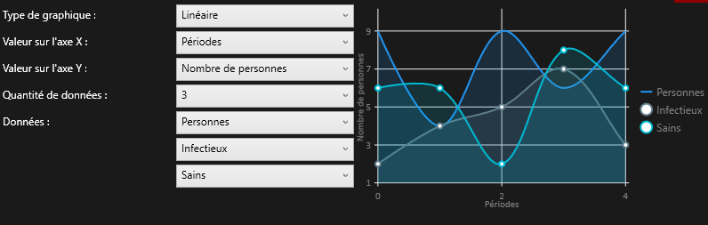

# Introduction
Le programme permet de générer une simulation du covid dans un environnement similaire à une ville. Différents paramètres sont disponibles permettant de modifier les résultats de celle-ci. Des graphiques entièrement personnalisables sont disponibles permettant la visualisation des données de la simulation. En plus des graphiques, une interface graphique affiche les individus, leur déplacement et leur état en temps réel.

# Paramétrage
De nombreux paramètres sont disponibles. Pour commencer, le nombre d'individus dans la simulation ainsi que le pourcentage de ce nombre qui sera infecté dès le démarrage de la simulation.

Figure 1: Paramètres généraux

Les paramètres en dessous permettent d'activer ou non les mesures et de décider à partir de combien d'individus infectés elles s'activeront ou désactiveront.

Les paramètres suivants concernent les mesures dont la quarantaine.
Elle peut être modifiée en choisissant qui doit être mis en quarantaine. La durée de quarantaines de chaque groupe peut être modifiée indépendamment ainsi que les probabilités d'être mis en quarantaine. Permettant de faire en sorte que certains individus échappent à la mise en quarantaine.

Ensuite la vaccination, il est possible de modifier sa durée ainsi que son efficacité à contrer le virus.

En dernier, le port du masque. Si les clients ou le staff travaillant dans un bâtiment doit le porter.

Figure 1: Paramètres généraux

Une fois que les mesures sont paramétrées, il est possible de modifier le virus. Il est possible de modifier sa durée, sa durée d'incubation, la durée de l'immunité ainsi que l'efficacité de l'immunité qui survient après avoir été infectée.

Il est possible de modifier les symptômes du virus. La toux peut être désactivée, réduisant la propagation du virus. Elle peut aussi être modifiée pour choisir la quantité de quanta qui sera exhalée par une personne contaminée. Les quantas augmentant les chances de transmission du virus.

Finalement, Il est possible de désactiver la transmission par aérosol du virus empêchant sa transmission.

# UI
## Graphiques

Dans l'onglet des paramètres graphiques, il est possible d'ajouter des graphiques.
Une fois ajoutées, les flèches permettent de changer sa taille saine que de le déplacer dans un espace vide. La croix permet de supprimer le graphique.

Figure 1: Flèches

S'il manque de la place, il est possible d'ajouter des lignes et colonnes ou d'en retirer.

Figure 1: Lignes et colonnes

En cliquant sur le bouton de paramétrage, une fenêtre s'ouvre offrant la possibilité de modifier le graphique.

Figure 1: Bouton de modification des paramètres du grahique

Depuis cette fenêtre, il est possible de modifier de nombreux paramètres à commencer par le type de graphique. 5 choix sont disponibles. Sur la droite des paramètres se situe une preview du graphique qui sera affiché.

Les deux paramètres suivants sont purement esthétiques et permettent de modifier la valeur qui sera affichée sur les axes. Les valeurs par défauts étant plus adéquates la plupart du temps.

Le quatrième paramètre permet de choisir le nombre de données à afficher sur le graphique allant de 1 à 5 pour certains graphiques, de 2 à 5 pour le graphique cylindrique et uniquement 1 valeur pour le graphique heatmap.

Il est ensuite possible de modifier ces valeurs indépendamment pour afficher les données souhaitées par la suite.

Il suffit ensuite de sauvegarder les paramètres pour qu'ils s'affichent dans la page de simulation.

Figure 1: Paramètres du graphique

## GUI
L'interface graphique est modifiable en termes de taille de la même manière que les graphiques.

Une fois que la simulation est lancée, elle affichera les bâtiments ainsi que les déplacements des individus.

Les individus normaux sont en bleu, les contaminé en rose, les infectieux en rouge et finalement les immunisés en jaune.

Figure 1: GUI

Il est possible de se déplacer à l'aide du clic gauche de la souris dans la fenêtre du GUI. Deux boutons en haut à gauche permettent de zoomer et dézoomer le GUI.

## Simulation

Lors de l'arrivée dans la page de simulation, les graphiques sont visibles. Pour démarrer la simulation il faut cliquer sur démarrer et attendre la fin de la création. Une fois créés, les graphiques vont automatiquement se mettre à jour avec les dernières données.

Il est possible de mettre pause et de réinitialiser la simulation pour modifier ses paramètres ou changer l'interface.

Figure 1: Bouton démarrer, pause et réinitialiser

Le slider permet de modifier la vitesse de la simulation allant de 1 seconde à gauche et aussi vite que possible à droite.

Figure 1: Slider

Une fois la simulation lancée, il est possible de cliquer sur le bouton "Données" qui permet d'afficher les données brutes de la simulation.

Figure 1: Données brutes

Il est possible de naviguer entre les jours, semaine, mois de la simulation et d'afficher uniquement le dernier. Il est aussi possible d'afficher la totalité des données.

Figure 1: Déplacement temporelle des graphiques

