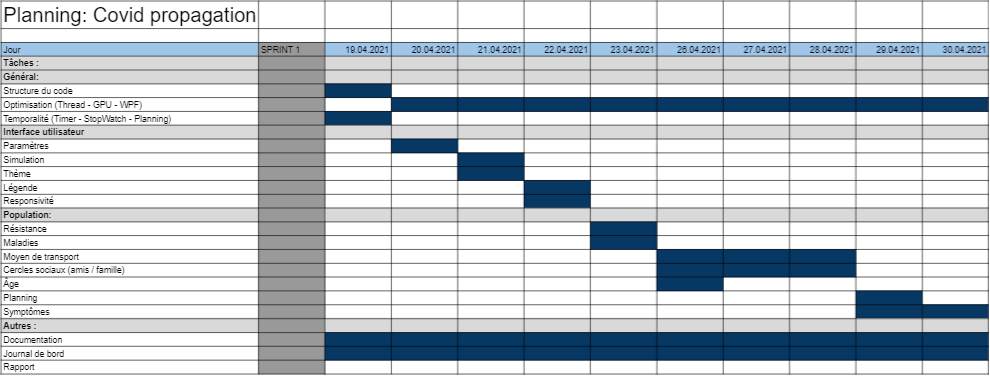

# 1. `Table des matières`
- [1. `Table des matières`](#1-table-des-matières)
- [2. `Résumé`](#2-résumé)
- [3. `Abstract`](#3-abstract)
- [4. `Introduction`](#4-introduction)
- [5. `Cahier des charges`](#5-cahier-des-charges)
  - [5.1. `Titre`](#51-titre)
  - [5.2. `Fonctionnalités`](#52-fonctionnalités)
  - [5.3. `Matériel et logiciels`](#53-matériel-et-logiciels)
  - [5.4. `Prérequis`](#54-prérequis)
  - [5.5. `Descriptif complet du projet`](#55-descriptif-complet-du-projet)
    - [5.5.1. `Méthodologie`](#551-méthodologie)
    - [5.5.2. `Description de l’application`](#552-description-de-lapplication)
      - [5.5.2.1. `Graphique`](#5521-graphique)
      - [5.5.2.2. `Interface graphique`](#5522-interface-graphique)
      - [5.5.2.3. `propagation`](#5523-propagation)
      - [5.5.2.4. `Population`](#5524-population)
        - [5.5.2.4.1. `Temporalité`](#55241-temporalité)
        - [5.5.2.4.2. `Individus`](#55242-individus)
        - [5.5.2.4.3. `Hopitaux / écoles / entreprise`](#55243-hopitaux--écoles--entreprise)
  - [5.6. `Protocols de tests`](#56-protocols-de-tests)
  - [5.7. `Persona`](#57-persona)
    - [5.7.1. `Utilisateur expérimenté`](#571-utilisateur-expérimenté)
    - [5.7.2. `Utilisateur inexpérimenté`](#572-utilisateur-inexpérimenté)
  - [5.8. `User stories`](#58-user-stories)
    - [5.8.1. `Ashley`](#581-ashley)
    - [5.8.2. `Kanan`](#582-kanan)
  - [5.9. `Diagramme d'activité`](#59-diagramme-dactivité)
  - [5.10. `Planning`](#510-planning)
  - [5.11. `Diagramme de classe initial`](#511-diagramme-de-classe-initial)
  - [5.12. `Interactions`](#512-interactions)
    - [5.12.1. `Menu principal`](#5121-menu-principal)
    - [5.12.2. `Population`](#5122-population)
    - [5.12.3. `Virus`](#5123-virus)
    - [5.12.4. `Affichage`](#5124-affichage)
    - [5.12.5. `Simulation`](#5125-simulation)
  - [5.13. `Livrables`](#513-livrables)
- [6. `Analyse interface graphique`](#6-analyse-interface-graphique)
  - [6.1. `Comparaison technologies`](#61-comparaison-technologies)
    - [6.1.1. `WinForm (Windows Forms)`](#611-winform-windows-forms)
    - [6.1.2. `WPF (Windows Presentation Foundation)`](#612-wpf-windows-presentation-foundation)
    - [6.1.3. `Unity`](#613-unity)
      - [6.1.3.1. `Communication`](#6131-communication)
        - [`Unity Controller`](#unity-controller)
        - [`PipeLines`](#pipelines)
      - [6.1.3.2. `Intégration `](#6132-intégration-)
  - [6.2. `Choix de la solution`](#62-choix-de-la-solution)
- [7. `Problèmes rencontrés`](#7-problèmes-rencontrés)
- [8. `Environnement`](#8-environnement)
- [9. `Architecture`](#9-architecture)
  - [9.1. `Arborescence`](#91-arborescence)
  - [9.2. `Structure`](#92-structure)
- [10. `Analyse fonctionnelle`](#10-analyse-fonctionnelle)
- [11. `Analyse organique`](#11-analyse-organique)
- [12. `Planning`](#12-planning)
  - [12.1. `Prévisionnel`](#121-prévisionnel)
  - [12.2. `Effectif`](#122-effectif)
- [13. `Bilan personnel`](#13-bilan-personnel)
- [14. `Conclusion`](#14-conclusion)
- [15. `Table des figures`](#15-table-des-figures)
- [16. `Bibliographie`](#16-bibliographie)
- [17. `Annexes`](#17-annexes)
- [18. `Livrables`](#18-livrables)

# 2. `Résumé`
Covid propagation est une application permettant de visualiser l'évolution du covid au sain d'un environnement peuplé d'individus uniques. La visualisation se fait à l'aide de graphiques (Colonne, courbe, circulaire) et de données tel que le nombre d'infecté actuellement ou le nombre de rétablissement ainsi qu'une interface graphique permettant la visualisation des individus, des lieux, des véhicules et de leurs déplacements.

L'utilisateur a une certaine liberté dans les paramètres de la simulation comme pour la création de la population en choisissant leur nombre et l'age moyen.

Des mesures contre le virus peuvent être prisent, limitant ou stoppant sa propagation.

# 3. `Abstract`

# 4. `Introduction`
Dans le cadre du cursus technicien, nous somme amené à réaliser un travail de diplôme qui dure du 19 avril aux 11 juin. Durant cette période, plusieurs évaluations intermédiaires sont prévuent, la première se situant 10 jours après le début du travail de diplôme. La seconde évaluation est prévu le 17 mai, la troisième le 31 mai et la dernière est le rendu final le 11 juin et dure 9 jours contrairement aux autres sprint qui durent 10 jours. 

Il est nécessaire de réaliser un poster pour ce travail ainsi que de remplir un journal de bord comprenant nos activités et nos réflexions.

Le but de mon projet est de simuler une propagation du covid dans une simulation dite individu-centré. Ce qui signifie que des individus sont simulé et agissent selont leur planning. S'ils sont infectés c'est en cas de contact avec une autre personne infectée. Les données utilisées sont des données officiels et sont maintenuent à jour aussi souvent que possible.

# 5. `Cahier des charges`
## 5.1. `Titre`
Covid propagation
## 5.2. `Fonctionnalités`
- Simulation
  - Population
    - Mesures
    - Hôpitaux
    - individus
      - Patient à risque
      - Âge
      - Décès dû au virus
      - Famille
      - Cercle d'amis
      - "Vie" *`Calendrier`*
  - Virus
    - propagation
    - effets sur les individus
      - De “Aucun”
      - À “Grave”
  - Hôpitaux
    - Places limitée
  - Mesure de sécuritées
    - Port du masque
    - Quarantaine
    - Confinement global
    - Distanciation
- Graphiques
  - Informations sur la population
    - Décès
    - Rétablissements
    - Infecté
    - Sains
  - Informations sur le virus
    - Dangerosité

## 5.3. `Matériel et logiciels`
- Pc techniciens
- Visual studio 2019
- Une connexion internet
- Github

## 5.4. `Prérequis`
- C#
- Visual studio 2019

## 5.5. `Descriptif complet du projet`
### 5.5.1. `Méthodologie`
Scrum

### 5.5.2. `Description de l’application`
Simuler un grand nombre de personnes possédant toutes des variables différentes (âge, résistance immunitaire,
etc...), y introduire le virus et observer sa propagation. Il est possible d’affecter des mesures de sécurité, tel que le port du masque ou la distanciation pour observer la possible réduction de la propagation.
L'affichage permet de voir en temps réel la propagation du virus et permet de visualiser chaque individu distinctement au besoin. Des graphiques sont aussi présents pour avoir une idée en chiffres de ce que signifie
l'affichage.

#### 5.5.2.1. `Graphique`
Les données des graphiques sont choisies par l'utilisateur et donc personnalisable. Plusieurs graphiques peuvent être affichés en même temps. Leur position est définie par l'utilisateur au sein de la page de l'application.

L'interface graphique est fournie par [LiveChart](https://lvcharts.net/App/examples/wpf/start). Les données sont directement fournies par l'application ainsi que les échelles de grandeurs qui sont ajustées automatiquement.
Les graphiques à courbes et en forme camembert sont disponibles.


#### 5.5.2.2. `Interface graphique`
En plus des graphiques, une interface graphique affichant les individus ainsi que leur lieur de travail, habitation et déplacement est disponible. Elle permet d'avoir une visualisation plus naturelle de la situation. Elle est très simple car simuler une ville est une tâche trop complexe et longue pour être ajoutée au projet. Il s'agit donc d'une aide visuel simple de la simulation. Il n'y a donc pas de routes ou autres éléments complexe similaires.
Voici deux exemples d'interface graphique :


#### 5.5.2.3. `propagation`
La propagation se fait à l'aide de calcul et de différentes variables. 1000 m<sup>2</sup> contenant 10 individus à l'intérieur aura de faibles chances de transmettre le virus. Le même nombre de personnes dans un espace clos de 10 m<sup>2</sup> aura des résultats totalement différents.
 
La température est prise est compte ainsi que les mesures telles que le masque. Le masque réduit les chances de transmettre le virus. La température, elle fait varier la durée de vie du virus à l'extérieur d'un hôte.
La complexité de ce type de calcul étant d'une difficulté largement supérieur aux compétences acquises en tant que technicien, je me base sur cette fiche Excel réalisée par des professionnels. Elle est très bien documentée et sourcée. 

[Fiche excel](https://docs.google.com/spreadsheets/d/1ZWG4LslRBUjMC00Rsi65TKmfVJyzVUf2)

#### 5.5.2.4. `Population`
La population est constituée d'objets C# généré partiellement, aléatoirement en fonction des paramètres de la simulation. Ils informent la simulation en cas de changement d'état (sain, infecté, etc...). Des itérations sont faites dans la simulation pour calculer si un individu est infecté ou non durant le temps écoulé. Il a un planning simple à suivre dans sa journée qui peut être constituée de par exemple :
- Être dans son habitation
- Prendre le bus
- Travailler
- Prendre le bus
- Faire les courses dans un supermarché
- Prendre le bus
- Et finalement rentrer chez sois

Ce planning est différent en fonction des individus même si vaguement le même. Durant sa journée, il croisera d'autres individus et à chaque itération, il aura des chances d'être infecté si des personnes aux alentours le sont. En fonction du lieu, il rencontrera des personnes différentes, parfois les mêmes comme dans son travail où ses collègues sont fixes. Dans le bus, des variations seront possibles. Son cercle d'amis ainsi que sa famille, lorsqu'il se trouve dans son habitation, seront les individus risquant de le contaminer.

##### 5.5.2.4.1. `Temporalité`
Le quotidien des individus est défini par la simulation lors de leur création. Elles peuvent évoluer avec l'âge des individus. 

Une itération est équivalente à ~30min dans la simulation. À chaque itération, chaque individu calcul ses chances d'attraper le virus en fonction de son environnement et des mesures prises. Elle permet aussi à un individu d'évoluer dans son quotidien en passant d'une tâche à une autre par exemple. Leur permettant aussi de changer de lieu et tous les événements liés à l'agenda des individus ainsi que la propagation du virus. La "durée" de la simulation est définie par l'utilisateur et peut donc durer plusieurs jours.

##### 5.5.2.4.2. `Individus`

Les individus possèdent différents paramètres qui vont modifier leur quotidien ainsi que leur résistance au virus. La valeur la plus essentielle est l'âge de ces personnes. L'âge permet de contribuer à la modification de la résistance au virus. Il modifie aussi le quotidien en définissant si la personne va travailler, va à l'école, est libre de faire ce qu'il souhaite ou rien si trop jeune. L'âge évolue avec le temps de la simulation.

Chaque individu a un entourage qui peut le contaminer. Il possède un cercle d'amis avec lequel il peut y avoir des contacts à domicile, et avec lequel il y aura des contacts en extérieur.
Il a aussi une famille avec qui les contacts se font majoritairement à domicile même s'il  peut y avoir des déplacements groupés. Par exemple déposer des enfants à l'école, aller au restaurant en famille.
Finalement, il a des collègues/camarades qui sont des contacts qui se trouve dans les écoles ou lieu de travail et qui sont ne définit pas ceux-ci.

Les moyens de transport des individus sont choisis par la simulation en fonction des paramètres de celle-ci. Un individu possédant une voiture aura beaucoup moins de risque de propager le virus qu'en prenant les transports publics. Il est cependant possible que d'autres personnes du cercle familial ou du cercle d'amis utilisent le même véhicule. De ce fait, il n'est pas forcement 100% sécurisé.
Les transports publics eux ont des risques élevés, car beaucoup de monde se situe dans le même véhicule de taille moyenne. En plus de cela, les individus sont en contact avec des étrangers qui peuvent varier en fonction des jours augmentant encore plus les chances de contagion.

La résistance au virus des individus défini si la personne a des symptômes en cas d'infection, si elle est asymptomatique, ou si elle a besoin de soins. Ce paramètre est défini par pourcentage. De 100% à 90% de résistance, l'individu est asymptomatique. De 90% à 50% de résistance, l'individu a des symptômes tels que la toux. De 50% à 10% de résistance, la personne est hospitalisée. Et finalement, à moins de 10%, l'individu est hospitalisé et risque la mort.
  - Plus ce paramètre est haut moins les effets du virus sont présents
  - 90-100 => asymptomatiques
  - 90-50 => symptômes normaux
  - 50< => hospitalisations
  - 10< => décès 

Chaque individu créé commence avec une valeur entre 80 et 100. Sachant qu'environ 5% de ces individus ont plus de 90 de résistance. Des maladies peuvent entrer en compte et baisser la résistance naturelle. Plus l'âge est élevé, plus l'individu sera impacté par un grand nombre de maladies et celles-ci seront plus dangereuses.

Les maladies sont inspirées de maladie réelle impactant l'effet du covid. Cependant, dans la simulation, elle n'affecte que la résistance au virus. Ces maladies apparaissent de façons aléatoires et plus fréquemment sur les individus dont l'âge est élevé. Elles ne se propagent pas. Elles sont en partie assignées au départ par la simulation puis apparaissent avec le temps. Elles réduisent la résistance au covid de 1% à 20% en fonction de la maladie et de l'âge de la personne.

##### 5.5.2.4.3. `Hopitaux / écoles / entreprise`
Ces différents lieux fonctionnent de façon similaire. Ils ont tous des individus en leur seins qui peuvent se transmettre le virus. Ils ont des tailles différentes en fonction du nombre de personnes pouvant être à l'intérieur. 

Les hôpitaux fonctionnent légérement différement. Ils ont des patients ainsi que des membres du staff de l'hopital. Il y a donc des différences de mesures et quantités. Les patients sont là de manière temporaire en fonction du nombre de personnes attrapant le covid.

Les écoles ont une situation similaire en aillant des élèves ainsi que des profs qui ont des mesures et quantités différentes.

Les entreprise elles fonctionnent en groupe d'individus, similaire aux classes des écoles mais sans personnel ayant des mesures différentes des autres.

## 5.6. `Protocols de tests`
Ce projet étant en c#, je vais utiliser les tests unitaires intégrés dans visual studio.

Les tests unitaires ne garantissant pas qu'il n'y ait aucun bug dans l'application, je vais créer des scénarios que je testerais avant et après chaque implémentation de fonctionnalités. Ces scénarios auront pour but de couvrir un maximum de possibilités pour éviter l'apparition de bug dû à une modification du code ou l'ajout d'une fonctionnalité. Ils permettent aussi de trouver d'éventuels des problèmes d'ergonomie en me plongeant à la place d'un utilisateur.

## 5.7. `Persona`
### 5.7.1. `Utilisateur expérimenté`

<p style="text-align: center">Figure 1: Persona experimenté</p>

### 5.7.2. `Utilisateur inexpérimenté`

<p style="text-align: center">Figure 2: Persona inexpérimenté</p>

## 5.8. `User stories`
### 5.8.1. `Ashley`
**En tant que** Ashley<br>
**Je veux** comparer différentes situations avec différentes personnes en prenant des mesures identiques<br>
**Afin de** pouvoir observer les différences et déterminer quelles mesures est efficaces dans quelle situation.<br>

**scénarios**
Je crée sans soucis une situation à l'aide de l'application. Pour ce faire, j'entre différents paramètres, tel que le nombre de personnes, les mesures prisent pour limiter la transmission ainsi que d'autres paramètres. <br>
J'observe la simulation et prends note des résultats.<br> 
Une fois terminée, j'en lance une autre avec certains paramètres différents et prends note des résultats.<br>
Je compare les résultats avec la simulation précédente et effectue ma conclusion.

### 5.8.2. `Kanan`
**En tant que** Kanan<br>
**Je veux** vérifier l'efficacité de différentes mesures prisent pour éviter la propagation du covid<br>
**Afin de** afin de me donner une idée concrète et visuelle de l'efficacité de ses mesures.<br>

**scénarios**
Je lance l'application et cherche à créer une simulation. Une fois trouvé, je peux voir les mesures qui apparaissent clairement, d'autres paramètres sont disponibles mais je n'y touche pas.<br>
Une fois la simulation lancée, je vois un message m'indiquant que celle-ci commence.<br>
Des aides sont disponibles me permettant de comprendre les données qui sont affichées. <br>
Après avoir terminé cette simulation, j'en lance une autre en désactivant les mesures. <br>
Je relance la simulation et observe la différence entre les deux simulations. <br>

## 5.9. `Diagramme d'activité`

<p style="text-align: center">Figure 3: Diagramme d'activité</p>

## 5.10. `Planning`
https://docs.google.com/spreadsheets/d/1tSpIbcDVvGnzMhEN71UDwPOxEy0oapQSSbxzjqXt3RA/edit?usp=sharing

## 5.11. `Diagramme de classe initial`

<p style="text-align: center">Figure 4: Diagrame de classe initial</p>

## 5.12. `Interactions`
### 5.12.1. `Menu principal`
- Affiche un preview de l'affichage de la simulation
- Btn Paramètres
  - Population
    - Remplace l'affichage actuel se situant à droite pour afficher les paramètres de la population
  - Virus
    - Remplace l'affichage actuel se situant à droite pour afficher les paramètres du virus
  - Affichage
    - Remplace l'affichage actuel se situant à droite pour afficher les paramètres de l'affichage
- Btn lancer la simulation
  - Change l'affichage de la totalité de l'application, affiche une barre de chargement indiquant l'état de création de la simulation.

### 5.12.2. `Population`
Affiche une page avec les paramètres suivant :
- Écoles / lieux de travail
  - Différentes selon l'âge
  - Zone de transmission
- Familles / Cercles d'amis
  - Transmission
- Moyenne d'âge de la population
  - Permet de modifier la moyenne d'âge de la population de 1 à ~100
  - Permet de délimiter une limite d'âge maximal et minimal
  - Il est possible de le laisser par défaut
- Nombre d'individus
  - Le nombre d'individus simulé dans une population
  - La limite n'est pas définie par le programme
  - L'utilisateur connaît les limites de sa machine
- Mesures
  - Permet de sélectionner plusieurs mesures
  - Les mesures ont un pourcentage d'efficacité
  - Permet de réduire les chances de propagation du virus
    - Affecte différemment le virus en fonction de la mesure
    - Pourrait totalement contrer un virus
  - Peut être modifier par l'utilisateur jusqu'à un niveau de 100% de protection
  - Valeur par défaut défini par des études sur le sujet
  - Appliquer uniquement sur certaines parties de la population
    - Infectés
    - Sains
    - À risques
- Cercle social
  - Ami
  - Famille
  - Collègues
  - ...
  - Transmissions accrues
  - Rencontres inclussent dans le planning journalier des individus
- Hôpitaux
  - Il y a plusieurs hôpitaux avec les options :
    - Copier
    - Coller
    - Appliquer sur tout
  - Permet de modifier le nombre d'hôpitaux
  - Permet de modifier le nombre de places
  - Stabilise les individus y étant admis
    - Réduis leurs chances de décès
  - Nécessite du personnel qui peut être infecté pour fonctionner
    - Mesures du personnel : 
      - Permet de sélectionner plusieurs mesures
      - Les mesures ont un pourcentage d'efficacité
      - Permet de réduire les chances de propagation du virus
        - Affecte différemment le virus en fonction de la mesure
        - Pourrait totalement contrer un virus
      - Peut être modifier par l'utilisateur jusqu'à un niveau de 100% de protection
- Btn annuler
  - Annule les modifications faites à l'hôpital
  - Réaffiche les données précédemment affichées
- Btn sauvegarder
  - Sauvegarde les paramètres choisis par l'utilisateur
### 5.12.3. `Virus`
Affiche une page avec les paramètres suivant :
- Effet sur le corps
  - Permet de modifier le pourcentage de propagation en fonction du symptôme (toux)
  - Les effets mortels nécessitant une hospitalisation 
- Moyens de transmissions
  - Sont impacté par les symptômes (en incrémentant l'efficacité)
  - Sont impacté par les mesures (en décrémentant l'efficacité)
- Durée
  - Permet de définir la durée durant laquelle le virus prend effet
- Asymptomatique
  - Permet de définir si oui ou non il y a des asymptomatiques
  - Permet de définir le pourcentage d'asymptomatiques

### 5.12.4. `Affichage`
Affiche une page avec les paramètres suivant :
- Graphiques
  - Permet de sélectionner différents styles de graphiques à afficher
    - Permet de sélectionner une donnée au choix en X et en Y
    - Un exemple du graphique avec les données est affiché à côté de la barre de sélection
  - Plusieurs graphiques possibles à sélectionner
- Affichage d'une "carte" permettant une visualisation plus simple

### 5.12.5. `Simulation`
Affiche une page :
- Affichage d'une barre de chargement lors de la génération de la simulation
  - Évolue en fonction du nombre d'individus créé
- Affiche les graphiques sélectionnés
  - Onglets permettant de sélectionner quel graphique affiché
  - Possibilité d'afficher jusqu'à 4 graphiques sur le même onglet
- S'actualise toutes les secondes (environ)

## 5.13. `Livrables`
- Mind Map
- Planning
- Rapport de projet
- Manuel utilisateur
- Journal de travail ou LogBook
- Résumé / Abstract

# 6. `Analyse interface graphique`
Cette analyse concerne l'interface graphique et le choix de la technologie à utiliser pour réaliser celle-ci.

## 6.1. `Comparaison technologies`
### 6.1.1. `WinForm (Windows Forms)`
Lors du CFC ainsi que de l'apprentissage technicien, nous avons toujours utilisé cet interface pour réaliser l'entièreté de nos projets. Je connais donc bien cet environnement contrairement au WPF. En plus de cela, l'interface graphique réalisée dans le poc est en WinForm. Me permettant donc de simplement importer le projet déjà existant.

Cependant, WinForm ainsi que l'interface graphique déjà existante apportent de gros problèmes tel que les timers. Lorsqu'il y a une charge CPU trop lourde, les timers perdent leur rythmes et n'arrivent plus à suivre. Le résultat de cette surcharge est que plus rien ne fait de sense. Les animations n'ont plus le temps de s'effectué rendant les individus immobile ou presque.

### 6.1.2. `WPF (Windows Presentation Foundation)`

WPF est plus récent que WinForms et a donc cerains avantage non négligeable en comparaison. Il est beaucoup plus complet en terme d'estéthique et donc d'UI que WinForms. En plus de cela, il est possible de créer des objets en 2D ou 3D. Ces objets contrairement à WinForms sont gérés par le GPU plutôt qu'être entièrement basé sur le CPU. Cet différence à elle-seule fait pencher la balance pour WPF.

La liaison entre la vue et les données est aussi plus efficaces ce qui est très important dans mon cas.

Cependant, une application WPF ne peut pas être lancée sur un mac ou sur linux. C'est un gros désavantage mais dans le cadre de se travail, il me semble négligeable.

<div style="page-break-after: always;"></div>
Le possible problème de timer bien que probablement réduit du au fait que la charge du CPU est allégé par la carte graphique, risque d'être toujours présent.

Il faut aussi noter que je n'ai aucune expérience en WPF et vait donc devoir m'y habituer durant un certain temps avant d'être efficace à 100%.

### 6.1.3. `Unity`
Unity est un moteur de jeu en 2D et 3D. Il est possible de l'intégrer directement à une application WPF. Ça me semble être le meilleur choix si l'on prend en compte les problèmes de timer des deux autres technologies. Unity possède de façon native des méthodes qui sont appelée à chaque frame permettant le bon déroulement de la simulation.

En plus de cela, j'ai beaucoup d'expérience avec ce logiciel, ayant réalisé mon TPI avec celui-ci. Je peux donc affirmer qu'il est beaucoup plus simple de réalisé l'interface graphique avec Unity.

Cependant un autre problème est présent. La liaison des données. Il m'est impossible, sans le tester, de savoir si ce modèle de fonctionnement est compatible avec mon projet. Je sais qu'il est possible de transférer des informations de WPF à unity cependant, je ne sais pas si la fréquence d'envoie est suffisante ou même si la quantité de données envoyées que je souhaite atteindre est possible.

#### 6.1.3.1. `Communication`
Pour communiquer entre WPF et Unity j'ai essayé plusieurs méthodes fonctionnant différement et surtout de complexité différente.
##### `Unity Controller`
Mon premier essai fut avec Unity Controller qui permet de créer un server qui communique entre une application C# et Unity.

Pour l'installer il faut d'ajouter le paquet nuget "Unity Controller" au projet ainsi qu'un using "UnityController". Sont implémentation est la plus simple des solutions testées sachant que sont implémentation ne prend que quelque lignes au total.

Le code dans un script unity ne comprend que deux lignes. La première étant le démarage du serveur.
```C#
void Start()
{
  UnityCommands.StartServer("008");
}
```

La deuxième s'updatant à chaque image, permet de recevoir la commande et de l'appliquer.
```C#
void Update()
{
  UnityCommands.ReceiveMessage();
}
```

Maintenant, dans le projet windows. Dans l'initialisation de la form, il faut démarrer le server en localhost.
```C#
public MainWindow()
{
  InitializeComponent();
  UnityCommands.StartClient("localhost", "008");
}
```

La dernière ligne située dans un évènement click d'un bouton permet de modifier l'élèment texte du GameObject "GameObjectText" en lui ajoutant la valeur "Texte".
```C#
private void Button_Click(object sender, RoutedEventArgs e)
{
  UnityCommands.UpdateText("GameObjectText", "Texte");
}
```

Cette implémentation de la communication est extrêmement simple à mettre en place cependant, les possibilités sont très limitées. Les seules actions possibles sont le fait de changer le texte d'un GameObject, sa couleur, son image, etc. Il est impossible d'envoyer un message de code à code puis de l'interpreter. Cette façon de faire ne peut donc pas servir à la réalisation de mon projet qui demande un traitement des données.

##### `PipeLines`
Contrairement à UnityController, les pipelines laissent plus de liberté mais leur complexité est bien supérieur. J'ai rencontré divers problème avant tout dans l'implémentation de l'asychrone. Un certain décalage des données créaient un résultat qui étaient lu comme des charactères chinois.

#### 6.1.3.2. `Intégration `


## 6.2. `Choix de la solution`
Mon attention se porte premièrement sur Unity qui me semble être la solution avec le meilleur rendu et permet de contourner certains problèmes présent dans les deux autres options. Le premier test que j'ai effectué ne permet pas de transmettre des données complexes, uniquement des strings ou images mais pas de list c# ou autre éléments que je pourrais utiliser.


# 7. `Problèmes rencontrés`

# 8. `Environnement`
L'environnement de travail est composé d'un pc technicien, 3 écrans, clavier, souris et d'un SSD amovible avec Windows 10 pro version 10.0.19042 Build 19042. Le code est réalisé à l'aide de visual studio 2019 versions 16.9.2. La documentation et le logbook sont réalisés à l'aide de visual studio code et des extensions Markdown All in One et Mardown PDF.
# 9. `Architecture`
## 9.1. `Arborescence`
```
├── CovidPropagationGraphicInterface
│   ├── .vs
│   ├── CovidPropagationGraphicInterface
│   └── CovidPropagationGraphicInterface.sln
└── Documentation
```
## 9.2. `Structure`

# 10. `Analyse fonctionnelle`
# 11. `Analyse organique`

# 12. `Planning`
## 12.1. `Prévisionnel`
Dans le cadre de ce projet, je vais commencer par réflechir à la structure général de celui-ci et de ces interactions entre les différentes section (Simulation - Graphique - etc.) ainsi que toujours trouver le meilleurs moyen d'optimiser le code et la structure pour permettre la simulation d'un plus grand nombre d'individus.

Les timers de Visual studio étant très aléatoire dès lors que le programme nécessite une trop grand charge de travail, je vais essayer de trouver une alternative ou de corriger ce problème en modifiant le timer.
Une fois la structure réfléchis et le problème de timer reglé, je vais commencer par créer l'interface de l'application où viendront s'ajouter tous les autres composants.
Je vais ensuite commencer à créer la population et vérifier que tout fonctionne correctement. Pour la population, j'aurais tout de même besoin d'une esquisse des batiments.

Après la population, et pour le second sprint, je pourrait commencer à générer la propagation ainsi que les batiments et leurs différents paramètres pour compléter la simulation.

Pour le troisième sprint, je vais m'attaquer à la partie graphique en commençant par les graphiques et la librairie Live Charts. Et je finirais par adapter l'interface graphique déjà existante au projet en y apportant des modifications majeurs.

Le dernier sprint est consacré entièrement aux finitions du projet ainsi qu'à l'optimisation et si le temps est suffisant, aux améliorations prévus dans le cahier des charges. Les deux derniers jours étant consacré entièrement à la documentation.




## 12.2. `Effectif`

# 13. `Bilan personnel`

# 14. `Conclusion`

# 15. `Table des figures`
- [Idée Bus 1](#34-Bus)

# 16. `Bibliographie`

19.04.2021
  - Utilisé dans la compairson entre les différentes technologies de l'interface graphique
    - [c-sharpcorner - Sandeep Mishra - WPF vs WinForms 1](https://www.c-sharpcorner.com/article/wpf-vs-winforms/#:~:text=The%20abbreviation%20W.P.F%20simply%20refers,to%20develop%20Windows%20desktop%20applications.)
    - [wpf-tutorial - WPF vs WinForms 2](https://www.wpf-tutorial.com/about-wpf/wpf-vs-winforms/)
    - [educba - Priya Pedamkar - WPF vs WinForms 3](https://www.educba.com/winforms-vs-wpf/)
    - [stackoverflow - Litisqe Kumar - WPF vs WinForms 4](https://stackoverflow.com/questions/31154338/windows-forms-vs-wpf)
  - Utilisés dans le programme de test WPF et unity
    - [stackoverflow - Programmer - Intégration d'unity en WPF](https://stackoverflow.com/questions/44059182/embed-unity3d-app-inside-wpf-application)
    - [youtube - Anousha - Communication](https://www.youtube.com/watch?v=rz6MNZMyza4)
    - [Packet NuGet sur Unity](https://github.com/GlitchEnzo/NuGetForUnity/releases)

# 17. `Annexes`
- Projet C#
- Images
  - Diagramme de classe
  - Planning prévisionnel
  - Planning effectif
- Journal de bord

# 18. `Livrables`
- Documentation
- Logbook
- Programme C#
- Poster