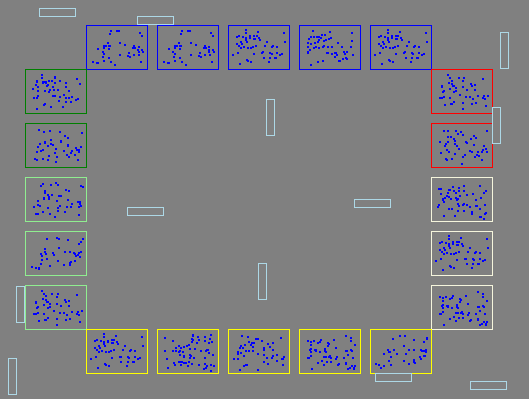
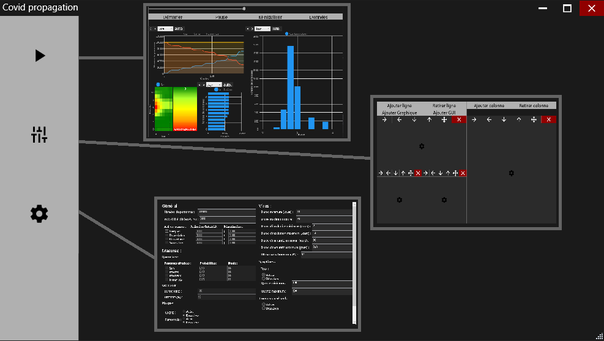
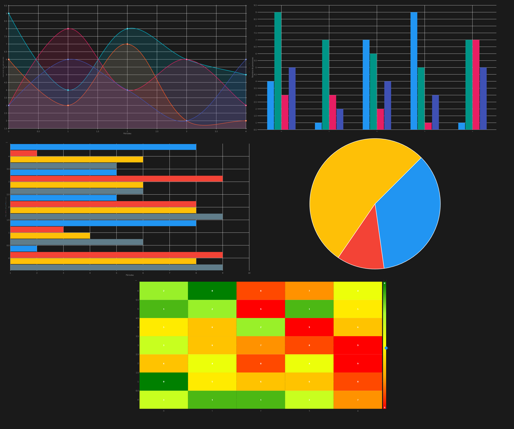

<center><h1>Travail de diplôme</h1></center>
<center><h2>Joey Martig</h2></center>
<center><h3>19.04.2021 - 11.06.2021</h3></center>

<center>


</center>


<center><h3>M. Michaël Mathieu</h3></center>
<center><h2>CFPT Informatique - Technicien ES</h2></center>
<center><h3>19.04.2021 - 11.06.2021</h3></center>


<div style="page-break-after: always;"></div>

# 1. `Table des matières`
- [1. `Table des matières`](#1-table-des-matières)
- [2. `Résumé`](#2-résumé)
- [3. `Abstract`](#3-abstract)
- [4. `Introduction`](#4-introduction)
  - [4.1. WPF](#41-wpf)
    - [4.1.1. Simulation](#411-simulation)
    - [4.1.2. UI](#412-ui)
  - [4.2. XML](#42-xml)
  - [4.3. Graphiques](#43-graphiques)
  - [4.4. Unity](#44-unity)
- [5. `Maquettes`](#5-maquettes)
  - [5.1. UI](#51-ui)
    - [5.1.1. Page Simulation](#511-page-simulation)
    - [5.1.2. Page Paramètres graphiques](#512-page-paramètres-graphiques)
    - [5.1.3. Page Paramètres](#513-page-paramètres)
    - [5.1.4. Page Informations](#514-page-informations)
  - [5.2. Interface Graphique](#52-interface-graphique)
- [6. `Organisation`](#6-organisation)
  - [6.1. Planification](#61-planification)
  - [6.2. Tâches](#62-tâches)
  - [6.3. Versionning - Backup](#63-versionning---backup)
  - [6.4. Communications](#64-communications)
- [7. `Technologies utilisées`](#7-technologies-utilisées)
  - [7.1. C](#71-c)
  - [7.2. Microsoft Visual studio](#72-microsoft-visual-studio)
  - [7.3. WPF](#73-wpf)
  - [7.4. Unity](#74-unity)
  - [7.5. XML](#75-xml)
  - [7.6. LiveCharts](#76-livecharts)
  - [7.7. JSON](#77-json)
- [8. `Cahier des charges`](#8-cahier-des-charges)
  - [8.1. Titre](#81-titre)
  - [8.2. Fonctionnalités](#82-fonctionnalités)
  - [8.3. Matériel et logiciels](#83-matériel-et-logiciels)
  - [8.4. Prérequis](#84-prérequis)
  - [8.5. Descriptif complet du projet](#85-descriptif-complet-du-projet)
    - [8.5.1. Méthodologie](#851-méthodologie)
    - [8.5.2. Description de l’application](#852-description-de-lapplication)
      - [8.5.2.1. Graphique](#8521-graphique)
      - [8.5.2.2. Interface graphique](#8522-interface-graphique)
      - [8.5.2.3. Propagation](#8523-propagation)
      - [8.5.2.4. Population](#8524-population)
        - [8.5.2.4.1. Temporalité](#85241-temporalité)
        - [8.5.2.4.2. Individus](#85242-individus)
        - [8.5.2.4.3. Hôpitaux / écoles / entreprise](#85243-hôpitaux--écoles--entreprise)
  - [8.6. Protocole de tests](#86-protocole-de-tests)
  - [8.7. Persona](#87-persona)
    - [8.7.1. Utilisateur expérimenté](#871-utilisateur-expérimenté)
    - [8.7.2. Utilisateur inexpérimenté](#872-utilisateur-inexpérimenté)
  - [8.8. User stories](#88-user-stories)
    - [8.8.1. Ashley](#881-ashley)
    - [8.8.2. Kanan](#882-kanan)
  - [8.9. Diagramme d'activité](#89-diagramme-dactivité)
  - [8.10. Planning](#810-planning)
  - [8.11. Diagramme de classe initial](#811-diagramme-de-classe-initial)
  - [8.12. Interactions](#812-interactions)
    - [8.12.1. Menu principal](#8121-menu-principal)
    - [8.12.2. Population](#8122-population)
    - [8.12.3. Virus](#8123-virus)
    - [8.12.4. Affichage](#8124-affichage)
    - [8.12.5. Simulation](#8125-simulation)
  - [8.13. Livrables](#813-livrables)
- [9. `Environnement`](#9-environnement)
- [10. `Analyse interface graphique`](#10-analyse-interface-graphique)
  - [10.1. Comparaison technologies](#101-comparaison-technologies)
    - [10.1.1. WinForm (Windows Forms)](#1011-winform-windows-forms)
    - [10.1.2. WPF (Windows Presentation Foundation)](#1012-wpf-windows-presentation-foundation)
    - [10.1.3. Unity](#1013-unity)
      - [10.1.3.1. Communication](#10131-communication)
        - [10.1.3.1.1. Unity Controller](#101311-unity-controller)
        - [10.1.3.1.2. `PipeLines`](#101312-pipelines)
      - [10.1.3.2. Intégration](#10132-intégration)
  - [10.2. Choix de la solution](#102-choix-de-la-solution)
- [11. `Problèmes rencontrés`](#11-problèmes-rencontrés)
  - [11.1. Pipeline](#111-pipeline)
  - [11.2. WPF UI](#112-wpf-ui)
  - [11.3. Planning](#113-planning)
  - [11.4. Outils WPF](#114-outils-wpf)
    - [11.4.1. Combobox et enum](#1141-combobox-et-enum)
    - [11.4.2. Description d'enums](#1142-description-denums)
    - [11.4.3. Numeric Up Down](#1143-numeric-up-down)
  - [11.5. Optimisation](#115-optimisation)
- [12. `Architecture`](#12-architecture)
  - [12.1. Arborescence](#121-arborescence)
  - [12.2. Structure des technologies](#122-structure-des-technologies)
  - [12.3. Structure générale](#123-structure-générale)
- [13. `Simulation`](#13-simulation)
  - [13.1. Structure](#131-structure)
    - [13.1.1. Intéraction entre objets](#1311-intéraction-entre-objets)
  - [13.2. Fonctionnement](#132-fonctionnement)
    - [13.2.1. Général](#1321-général)
    - [13.2.2. Propagation](#1322-propagation)
    - [13.2.3. Source propagation](#1323-source-propagation)
    - [13.2.4. Résultats](#1324-résultats)
  - [13.3. Performances](#133-performances)
- [14. `GUI`](#14-gui)
  - [14.1. Structure](#141-structure)
    - [14.1.1. Interactions entre les objets](#1411-interactions-entre-les-objets)
  - [14.2. Fonctionnement](#142-fonctionnement)
- [15. `UI`](#15-ui)
  - [15.1. Structure](#151-structure)
  - [15.2. Thème](#152-thème)
  - [15.3. Pages](#153-pages)
    - [15.3.1. Simulation](#1531-simulation)
    - [15.3.2. Paramètres graphiques](#1532-paramètres-graphiques)
    - [15.3.3. Paramètres simulation](#1533-paramètres-simulation)
- [16. `Planning`](#16-planning)
  - [16.1. Prévisionnel](#161-prévisionnel)
  - [16.2. Effectif](#162-effectif)
- [17. `Bilan personnel`](#17-bilan-personnel)
- [18. `Conclusion`](#18-conclusion)
- [19. `Table des figures`](#19-table-des-figures)
- [20. `Bibliographie`](#20-bibliographie)
- [21. `Annexes`](#21-annexes)
- [22. `Livrables`](#22-livrables)

# 2. `Résumé`

Le but de ce projet est de réussir à simuler une population dans un environnement agencé comme une ville. Chaque individu est unique et possède un planning qu'il suivra en se déplaçant dans différents lieux. Le virus se propagera au sein de cette simulation d'individus en individu en fonction des contacts au sein de celle-ci.

La simulation peut être configurée par l'utilisateur en modifiant la taille de celle-ci ainsi que les mesures qui sont prises pour limiter la propagation du virus. Permettant donc de voir la différence que certaines mesures peuvent appliquer.

Pour visualiser la simulation, l'utilisateur a accès à une grande variété de graphiques ainsi qu'une interface graphique représentant les individus et leurs déplacements. Les graphiques ainsi que l'interface sont entièrement personnalisables en terme de données ainsi que d'agencement et de taille.

Finalement, la majorité des données utilisée pour la réalisation de ce projet sont des données officielles permettant de se rapprocher au maximum de la réalité. Lorsqu'aucune donnée n'est disponible pour certains paramètres, celle-ci est tout de même inspirée au maximum des effets de la réalité pour éviter que son impact soit trop important et ne modifie trop les résultats.

# 3. `Abstract`
The goal of this project is to create a simulation that is able to create a population and its environment which is arranged like a city. Every person in the simulation is unique and follow a planning that tell them to go in different places. The virus spread in the simulation from person to person when they enter in physical contact.

The simulation can be configured by the user by modifying its size and the measures taken to prevent the spreading of the virus. Letting the user see the impact of such measures.

A vast variety of graphics are available to the user for him to visualize the state of the simulation. A graphical user interface can also be added to be able to have a visual depiction of what is happening in the simulation. The user interface of the simulation is entirely customizable by letting the user choose which graphics should be displayed, their size and location in the window.

All the data used to create this project are officials covid Datas, bringing the simulation as close to reality as possible. If no data is available, then it is inspired by a real event and its effect is minimized to avoid it to change the outcome of the simulation.

# 4. `Introduction`
Dans le cadre du cursus technicien, nous sommes amenés à réaliser un travail de diplôme qui dure du 19 avril aux 11 juin. Durant cette période, plusieurs évaluations intermédiaires sont prévues, la première se situant 10 jours après le début du travail de diplôme. La seconde évaluation est prévue le 17 mai, la troisième le 31 mai et la dernière est le rendu final le 11 juin et dure 9 jours contrairement aux autres sprints qui durent 10 jours. 

Il est nécessaire de réaliser un poster pour ce travail ainsi que de remplir un journal de bord comprenant nos activités et nos réflexions.

Le but de mon projet est de simuler une propagation du covid dans une simulation dite individu centré. Ce qui signifie que des individus sont simulés et agissent selon leur planning. S'ils sont infectés, c'est en cas de contact avec une autre personne infectée. Les données utilisées sont des données officielles et sont maintenues à jour aussi souvent que possible.

Ce document contient des références à la documentation qui sont au format ####. Ces références permettent d'accéder directement au code source en faisant une recherche avec la référence dans celcui-ci.

## 4.1. WPF
Le programme WPF est le coeur de l'application, il réunit toutes les sections du projet et les gère.
### 4.1.1. Simulation
La simulation génère tous les objets nécessaires au fonctionnement de celle-ci. Ses paramètres peuvent être modifiés depuis L'UI. Ses paramètres concernant le virus sont écrits dans un fichier XML. La simulation gère aussi la temporalité permettant la propagation et les déplacements.

### 4.1.2. UI
L'interface utilisateur est gérée par les grilles WPF permettant un affichage responsive. Elle permet à l'utilisateur de modifier les paramètres de la simulation ainsi que les paramètres d'affichage des graphiques. 

## 4.2. XML
Les paramètres jugés fixes du virus sont stockés dans un fichier XML.

## 4.3. Graphiques
Les graphiques sont créés par la librairie liveCharts qui permet l'affichage de nombreux type de graphiques ainsi qu'un grand contrôle sur ceux-ci. Les données sont mises à jour en temps réel et des animations intégrées à la librairie.

## 4.4. Unity
Le programme Unity s'occupe de gérer l'interface graphique qui comprend les bâtiments, véhicules et individus. L'interface est animée en fonction de la temporalité de l'application WPF. La simulation et l'interface graphique avancent donc ensemble. La communication s'effectue à travers un pipeline nommé. Les données de la simulation sont envoyées par celui-ci. Le programme Unity est intégré directement dans le projet WPF.

# 5. `Maquettes`
## 5.1. UI
### 5.1.1. Page Simulation

<center><p style="font-size: 11px">Figure 1: Maquette page de simulation</p></center>

La page simulation permet la visualisation de la simulation via les graphiques, l'interface graphique ou des données brutes.

### 5.1.2. Page Paramètres graphiques

<center><p style="font-size: 11px">Figure 2: Maquette page de paramètres graphiques 1</p></center>
Cette page permet à l'utilisateur de modifier l'interface graphique qui s'affichera dans la page simulation.


<center><p style="font-size: 11px">Figure 3: Maquette page de paramètres graphiques 2</p></center>
Cette section permet de modifier en détail les paramètres d'un graphique.

### 5.1.3. Page Paramètres

<center><p style="font-size: 11px">Figure 4: Maquette page de paramètres</p></center>
Cette page permet à l'utilisateur de modifier les paramètres de la simulation.

### 5.1.4. Page Informations

<center><p style="font-size: 11px">Figure 5: Maquette page d'informations</p></center>
Cette page sert d'aide à l'utilisateur sur le fonctionnement de l'application et contient aussi des informations sur sa logique et ses sources.

## 5.2. Interface Graphique

<center><p style="font-size: 11px">Figure 6: Maquette interface graphique</p></center>
L'interface graphique permet de visualiser ce qui se passe dans la simulation. Les bâtiments, les véhicules et les individus sont affichés ainsi que leur déplacement et leur statut.

# 6. `Organisation`
## 6.1. Planification
Pour la planification du travail de diplôme, j'ai décidé d'utiliser Excel qui permet de réaliser un planning simple et très compréhensible. Le planning me servant de fil conducteur et de moyen d'organiser l'ordre d'exécution des tâches que j'ai créé. 
## 6.2. Tâches
Le traçage des tâches s'effectue sur github en suivant le modèle de scrum. Les tâches à effectuer sont dans une section "To Do" les tâches qui sont en cours, sont dans la section "In progress" et finalement les tâches terminées sont dans la section "Done".

Les sprints sont tous séparés ayant des tâches différentes.


<center><p style="font-size: 11px">Figure 7: Gestion des tâches</p></center>

## 6.3. Versionning - Backup
Le versionning est fait à l'aide de github. Au moins deux sauvegardes sont faites chaque jour. Une à midi et une en fin de journée. En cas de perte de données, je ne perds qu'une demi-journée dans le pire des cas. 

Ayant eu des problèmes avec git par le passé. ( Corruptions de fichiers - conflits ) J'ai décidé de faire une sauvegarde supplémentaire sur un disque dur externe. La fréquence de sauvegarde étant plus faible, mais suffisante étant donné qu'il s'agit d'une sauvegarde de secours.


## 6.4. Communications
Nous nous sommes mis d'accord sur le fait de se contacter au moins une fois par semaine pour vérifier l'avancement du projet ou poser différentes questions. Sachant que nous pouvons nous contacter à tout moment par mails. Nous avons établi des intervalles réguliers chaque semaine:
- Mardi --> Meet
- Vendredi --> En personne

# 7. `Technologies utilisées`
## 7.1. C#
C# est un langage de programmation orienté objet développé dans les années 2000 par Microsoft. Sa première version a été adoptée comme standard international en 2002 par Ecma.
Il est régulièrement mis à jour, des versions majeures sont publiées tous les 2 à 3 ans environ.
La dernière version de C# est la version 8.0 et c’est avec celle-ci que j’ai développé l’application.
Son environnement de développement Visual Studio permet de créer des applications Windows
facilement.

## 7.2. Microsoft Visual studio
Microsoft Visual Studio est une suite de logiciels disponibles sur Windows et mac. La dernière version qui est la version utilisée dans la réalisation de ce projet est la version 2019.

Il permet de générer des services web XML, des applications web ASP .NET, des applications Visual basic, Visual C++, Visual C#. C#, C++ et basic utilisent tous les mêmes IDE, ce qui permet de partager certaines ressources.

## 7.3. WPF
Windows Presentation Foundation (WPF) ou nom de code Avalon est une spécification graphique de .NET 3.0. Il utilise le XAML qui le rapproche d'une page HTML avec un système de balise. Il est apparu en 2006.

WPF comparé à WinForms permet par exemple l'affichage d'une interface responsive et l'utilisation du GPU pour certaines fonctionnalités.

## 7.4. Unity
Unity est un moteur de jeu développé par Unity Technologies. Il est majoritairement utilisé par des petits studios et des indépendants pour la création de jeux. Il est compatible avec le C# et le JavaScript qui permet de réaliser les scripts. Il permet de développer des jeux compatibles avec Windows, Mac OS X, iOS, Android, TV OS, PlayStation 3, PlayStation Vita, PlayStation 4, Xbox 360, Xbox One, Xbox One X, Windows Phone 8, Windows 10 Mobile , PlayStation Mobile, Tizen, Oculus Rift, Wii U, Nintendo 3DS, Nintendo Switch, WebGL.

## 7.5. XML
XML qui est un acronyme pour Extensible Markup Language. C'est un langage de balises et fait parti du sous-ensemble du standard Generalized Markup Language (SGML). Il a été créé en 1999.

Le bute premier du XML étant de permettre au SGML d'être utilisé sur le web de la même manière que le HTML.
Dans mon cas, il  permettra de stocker certaines données du programme.

## 7.6. LiveCharts
LiveCharts est une librairie C# permettant de créer des graphiques. Il permet d'inclure une grande quantité de graphiques à des projets, de lier les données au code. Lorsque les données changent, les graphiques s'adaptent automatiquement et sont animés. Les graphiques sont personnalisables et interactable. Il est même possible d'importer des cartes composées de régions en tant que graphique.

En plus d'ajouter énormément d'éléments graphiques et animations, LiveCharts est très performant et peut par exemple afficher des graphiques contenant plus de 100'000 points tout en restant fluides.

Cette librairie est open-source et ne nécessite donc pas de license. Une version 2.0 est actuellement en cours de développement promettant principalement d'augmenter les performances.

## 7.7. JSON
JavaScript Object Notation (JSON) est un format de données dérivé de la notation des objets JavaScript. Il permet d'afficher la structure d'une information comme par exemple un objet C# ainsi que ses données. C'est le format de données qui me permet de communiquer avec le programme Unity depuis le programme WPF.

# 8. `Cahier des charges`
## 8.1. Titre
Covid propagation
## 8.2. Fonctionnalités
- Simulation
  - Population
    - Mesures
    - Hôpitaux
    - individus
      - Patient à risque
      - Âge
      - Décès dû au virus
      - Famille
      - Cercle d'amis
      - "Vie" *`Calendrier`*
  - Virus
    - propagation
    - effets sur les individus
      - De “Aucun”
      - À “Grave”
  - Hôpitaux
    - Places limitées
  - Mesures de sécuritées
    - Port du masque
    - Quarantaine
    - Confinement global
    - Distanciation
- Graphiques
  - Informations sur la population
    - Décès
    - Rétablissements
    - Infecté
    - Sains
  - Informations sur le virus
    - Dangerosité

## 8.3. Matériel et logiciels
- PC techniciens
- Visual studio 2019
- Une connexion internet
- Github

## 8.4. Prérequis
- C#
- Visual studio 2019

## 8.5. Descriptif complet du projet
### 8.5.1. Méthodologie
Scrum

### 8.5.2. Description de l’application
Simuler un grand nombre de personnes possédant toutes des variables différentes (âge, résistance immunitaire,
etc.), y introduire le virus et observer sa propagation. Il est possible d’affecter des mesures de sécurité, telles que le port du masque ou la distanciation pour observer la possible réduction de la propagation.
L'affichage permet de voir en temps réel la propagation du virus et permet de visualiser chaque individu distinctement au besoin. Des graphiques sont aussi présents pour avoir une idée en chiffres de ce que signifie
l'affichage.

#### 8.5.2.1. Graphique
Les données des graphiques sont choisies par l'utilisateur et donc personnalisables. Plusieurs graphiques peuvent être affichés en même temps. Leur position est définie par l'utilisateur au sein de la page de l'application.

L'interface graphique est fournie par [LiveChart](https://lvcharts.net/App/examples/wpf/start). Les données sont directement fournies par l'application ainsi que les échelles de grandeurs qui sont ajustées automatiquement.
Les graphiques à courbes et en forme camembert sont disponibles.

<center><p style="font-size: 11px">Figure 8: Exemple de graphiques</p></center>

#### 8.5.2.2. Interface graphique
En plus des graphiques, une interface graphique affichant les individus ainsi que leur lieur de travail, habitation et déplacement est disponible. Elle permet d'avoir une visualisation plus naturelle de la situation. Elle est très simple, car simuler une ville est une tâche trop complexe et longue pour être ajoutée au projet. Il s'agit donc d'une aide visuelle simple de la simulation. Il n'y a donc pas de routes ou autres éléments complexe similaire.
Voici deux exemples d'interface graphique :

<center><p style="font-size: 11px">Figure 9: Exemple d'interface graphique</p></center>

#### 8.5.2.3. Propagation

La propagation se fait à l'aide de calcul et de différentes variables. 1000 m<sup>2</sup> contenant 10 individus à l'intérieur aura de faibles chances de transmettre le virus. Le même nombre de personnes dans un espace clos de 10 m<sup>2</sup> aura des résultats totalement différents.
 
La température est prise est compte ainsi que les mesures telles que le masque. Le masque réduit les chances de transmettre le virus. La température, elle fait varier la durée de vie du virus à l'extérieur d'un hôte.
La complexité de ce type de calcul étant d'une difficulté largement supérieure aux compétences acquises en tant que technicien, je me base sur cette fiche Excel réalisée par des professionnels. Elle est très bien documentée et sourcée. 

[Fiche Excel](https://drive.google.com/file/d/1hWvw8I-53Iw7GPy-B1mSyWen20VzTwWr/view?usp=sharing)

#### 8.5.2.4. Population

La population est constituée d'objets C# générés partiellement, aléatoirement en fonction des paramètres de la simulation. Ils informent la simulation en cas de changement d'état (sain, infecté, etc.). Des itérations sont faites dans la simulation pour calculer si un individu est infecté ou non durant le temps écoulé. Il a un planning simple à suivre dans sa journée qui peut être constituée de par exemple :
- Être dans son habitation
- Prendre le bus
- Travailler
- Prendre le bus
- Faire les courses dans un supermarché
- Prendre le bus
- Et finalement rentrer chez sois

Ce planning est différent en fonction des individus même si vaguement le même. Durant sa journée, il croisera d'autres individus et à chaque itération, il aura des chances d'être infecté si des personnes aux alentours le sont. En fonction du lieu, il rencontrera des personnes différentes, parfois les mêmes comme dans son travail où ses collègues sont fixes. Dans le bus, des variations seront possibles. Son cercle d'amis ainsi que sa famille, lorsqu'il se trouve dans son habitation, seront les individus risquant de le contaminer.

##### 8.5.2.4.1. Temporalité

Le quotidien des individus est défini par la simulation lors de leur création. Elles peuvent évoluer avec l'âge des individus. 

Une itération est équivalente à ~30min dans la simulation. À chaque itération, chaque individu calcul ses chances d'attraper le virus en fonction de son environnement et des mesures prises. Elle permet aussi à un individu d'évoluer dans son quotidien en passant d'une tâche à une autre par exemple. Leur permettant aussi de changer de lieu et tous les événements liés à l'agenda des individus ainsi que la propagation du virus. La "durée" de la simulation est définie par l'utilisateur et peut donc durer plusieurs jours.

##### 8.5.2.4.2. Individus

Les individus possèdent différents paramètres qui vont modifier leur quotidien ainsi que leur résistance au virus. La valeur la plus essentielle est l'âge de ces personnes. L'âge permet de contribuer à la modification de la résistance au virus. Il modifie aussi le quotidien en définissant si la personne va travailler, va à l'école, est libre de faire ce qu'il souhaite ou rien si trop jeune. L'âge évolue avec le temps de la simulation.

Chaque individu a un entourage qui peut le contaminer. Il possède un cercle d'amis avec lequel il peut y avoir des contacts à domicile, et avec lequel il y aura des contacts en extérieur.
Il a aussi une famille avec qui les contacts se font majoritairement à domicile même s'il  peut y avoir des déplacements groupés. Par exemple déposer des enfants à l'école, aller au restaurant en famille.
Finalement, il a des collègues/camarades qui sont des contacts qui se trouve dans les écoles ou lieu de travail et qui sont ne définit pas ceux-ci.

Les moyens de transport des individus sont choisis par la simulation en fonction des paramètres de celle-ci. Un individu possédant une voiture aura beaucoup moins de risque de propager le virus qu'en prenant les transports publics. Il est cependant possible que d'autres personnes du cercle familial ou du cercle d'amis utilisent le même véhicule. De ce fait, il n'est pas forcement 100% sécurisé.
Les transports publics eux ont des risques élevés, car beaucoup de monde se situe dans le même véhicule de taille moyenne. En plus de cela, les individus sont en contact avec des étrangers qui peuvent varier en fonction des jours augmentant encore plus les chances de contagion.

La résistance au virus des individus défini si la personne a des symptômes en cas d'infection, si elle est asymptomatique, ou si elle a besoin de soins. Ce paramètre est défini par pourcentage. De 100% à 90% de résistance, l'individu est asymptomatique. De 90% à 50% de résistance, l'individu a des symptômes tels que la toux. De 50% à 10% de résistance, la personne est hospitalisée. Et finalement, à moins de 10%, l'individu est hospitalisé et risque la mort.
  - Plus ce paramètre est haut moins les effets du virus sont présents
  - 90-100 => asymptomatiques
  - 90-50 => symptômes normaux
  - 50< => hospitalisations
  - 10< => décès 

Chaque individu créé commence avec une valeur entre 80 et 100. Sachant qu'environ 5% de ces individus ont plus de 90 de résistance. Des maladies peuvent entrer en compte et baisser la résistance naturelle. Plus l'âge est élevé, plus l'individu sera impacté par un grand nombre de maladies et celles-ci seront plus dangereuses.

Les maladies sont inspirées de maladie réelle impactant l'effet du covid. Cependant, dans la simulation, elle n'affecte que la résistance au virus. Ces maladies apparaissent de façons aléatoires et plus fréquemment sur les individus dont l'âge est élevé. Elles ne se propagent pas. Elles sont en partie assignées au départ par la simulation puis apparaissent avec le temps. Elles réduisent la résistance au covid de 1% à 20% en fonction de la maladie et de l'âge de la personne.

##### 8.5.2.4.3. Hôpitaux / écoles / entreprise

Ces différents lieux fonctionnent de façon similaire. Ils ont tous des individus en leurs seins qui peuvent se transmettre le virus. Ils ont des tailles différentes en fonction du nombre de personnes pouvant être à l'intérieur. 

Les hôpitaux fonctionnent légèrement différemment. Ils ont des patients ainsi que des membres du staff de l'hôpital. Il y a donc des différences de mesures et quantités. Les patients sont là de manière temporaire en fonction du nombre de personnes attrapant le covid.

Les écoles ont une situation similaire en ayant des élèves ainsi que des profs qui ont des mesures et quantités différentes.

Les entreprises elles fonctionnent en groupe d'individus, similaire aux classes des écoles, mais sans personnel ayant des mesures différentes des autres.

## 8.6. Protocole de tests
Ce projet étant en c#, je vais utiliser les tests unitaires intégrés dans visual studio.

Les tests unitaires ne garantissant pas qu'il n'y ait aucun bug dans l'application, je vais créer des scénarios que je testerais avant et après chaque implémentation de fonctionnalités. Ces scénarios auront pour but de couvrir un maximum de possibilités pour éviter l'apparition de bug dû à une modification du code ou l'ajout d'une fonctionnalité. Ils permettent aussi de trouver d'éventuels des problèmes d'ergonomie en me plongeant à la place d'un utilisateur.

## 8.7. Persona
### 8.7.1. Utilisateur expérimenté

<p style="text-align: center">Figure 10: Persona experimenté</p>

### 8.7.2. Utilisateur inexpérimenté

<p style="text-align: center">Figure 11: Persona inexpérimenté</p>

## 8.8. User stories
### 8.8.1. Ashley
**En tant que** Ashley<br>
**Je veux** comparer différentes situations avec différentes personnes en prenant des mesures identiques<br>
**Afin de** pouvoir observer les différences et déterminer quelles mesures est efficaces dans quelle situation.<br>

**scénarios**
Je crée sans soucis une situation à l'aide de l'application. Pour ce faire, j'entre différents paramètres, tel que le nombre de personnes, les mesures prisent pour limiter la transmission ainsi que d'autres paramètres. <br>
J'observe la simulation et prends note des résultats.<br> 
Une fois terminée, j'en lance une autre avec certains paramètres différents et prends note des résultats.<br>
Je compare les résultats avec la simulation précédente et effectue ma conclusion.

### 8.8.2. Kanan
**En tant que** Kanan<br>
**Je veux** vérifier l'efficacité de différentes mesures prisent pour éviter la propagation du covid<br>
**Afin de** afin de me donner une idée concrète et visuelle de l'efficacité de ses mesures.<br>

**scénarios**
Je lance l'application et cherche à créer une simulation. Une fois trouvé, je peux voir les mesures qui apparaissent clairement, d'autres paramètres sont disponibles, mais je n'y touche pas.<br>
Une fois la simulation lancée, je vois un message m'indiquant que celle-ci commence.<br>
Des aides sont disponibles me permettant de comprendre les données qui sont affichées. <br>
Après avoir terminé cette simulation, j'en lance une autre en désactivant les mesures. <br>
Je relance la simulation et observe la différence entre les deux simulations. <br>

## 8.9. Diagramme d'activité

<p style="text-align: center">Figure 12: Diagramme d'activité</p>

## 8.10. Planning
https://docs.google.com/spreadsheets/d/1tSpIbcDVvGnzMhEN71UDwPOxEy0oapQSSbxzjqXt3RA/edit?usp=sharing

## 8.11. Diagramme de classe initial

<p style="text-align: center">Figure 13: Diagrame de classe initiale</p>

## 8.12. Interactions
### 8.12.1. Menu principal
- Affiche un preview de l'affichage de la simulation
- Btn Paramètres
  - Population
    - Remplace l'affichage actuel se situant à droite pour afficher les paramètres de la population
  - Virus
    - Remplace l'affichage actuel se situant à droite pour afficher les paramètres du virus
  - Affichage
    - Remplace l'affichage actuel se situant à droite pour afficher les paramètres de l'affichage
- Btn lancer la simulation
  - Change l'affichage de la totalité de l'application, affiche une barre de chargement indiquant l'état de création de la simulation.

### 8.12.2. Population
Affiche une page avec les paramètres suivant :
- Écoles / lieux de travail
  - Différentes selon l'âge
  - Zone de transmission
- Familles / Cercles d'amis
  - Transmission
- Moyenne d'âge de la population
  - Permet de modifier la moyenne d'âge de la population de 1 à ~100
  - Permet de délimiter une limite d'âge maximal et minimal
  - Il est possible de le laisser par défaut
- Nombre d'individus
  - Le nombre d'individus simulé dans une population
  - La limite n'est pas définie par le programme
  - L'utilisateur connaît les limites de sa machine
- Mesures
  - Permet de sélectionner plusieurs mesures
  - Les mesures ont un pourcentage d'efficacité
  - Permet de réduire les chances de propagation du virus
    - Affecte différemment le virus en fonction de la mesure
    - Pourrait totalement contrer un virus
  - Peut-être modifier par l'utilisateur jusqu'à un niveau de 100% de protection
  - Valeur par défaut défini par des études sur le sujet
  - Appliquer uniquement sur certaines parties de la population
    - Infectés
    - Sains
    - À risques
- Cercle social
  - Ami
  - Famille
  - Collègues
  - ...
  - Transmissions accrues
  - Rencontres inclusent dans le planning journalier des individus
- Hôpitaux
  - Il y a plusieurs hôpitaux avec les options :
    - Copier
    - Coller
    - Appliquer sur tout
  - Permet de modifier le nombre d'hôpitaux
  - Permet de modifier le nombre de places
  - Stabilise les individus y étant admis
    - Réduis leurs chances de décès
  - Nécessite du personnel qui peut être infecté pour fonctionner
    - Mesures du personnel : 
      - Permet de sélectionner plusieurs mesures
      - Les mesures ont un pourcentage d'efficacité
      - Permet de réduire les chances de propagation du virus
        - Affecte différemment le virus en fonction de la mesure
        - Pourrait totalement contrer un virus
      - Peut-être modifier par l'utilisateur jusqu'à un niveau de 100% de protection
- Btn annuler
  - Annule les modifications faites à l'hôpital
  - Réaffiche les données précédemment affichées
- Btn sauvegarder
  - Sauvegarde les paramètres choisis par l'utilisateur
### 8.12.3. Virus
Affiche une page avec les paramètres suivant :
- Effet sur le corps
  - Permet de modifier le pourcentage de propagation en fonction du symptôme (toux)
  - Les effets mortels nécessitant une hospitalisation 
- Moyens de transmissions
  - Sont impacté par les symptômes (en incrémentant l'efficacité)
  - Sont impacté par les mesures (en décrémentant l'efficacité)
- Durée
  - Permet de définir la durée durant laquelle le virus prend effet
- Asymptomatique
  - Permet de définir si oui ou non il y a des asymptomatiques
  - Permet de définir le pourcentage d'asymptomatiques

### 8.12.4. Affichage
Affiche une page avec les paramètres suivant :
- Graphiques
  - Permet de sélectionner différents styles de graphiques à afficher
    - Permet de sélectionner une donnée au choix en X et en Y
    - Un exemple du graphique avec les données est affiché à côté de la barre de sélection
  - Plusieurs graphiques possibles à sélectionner
- Affichage d'une "carte" permettant une visualisation plus simple

### 8.12.5. Simulation
Affiche une page :
- Affichage d'une barre de chargement lors de la génération de la simulation
  - Évolue en fonction du nombre d'individus créé
- Affiche les graphiques sélectionnés
  - Onglets permettant de sélectionner quel graphique affiché
  - Possibilité d'afficher jusqu'à 4 graphiques sur le même onglet
- S'actualise toutes les secondes (environ)

## 8.13. Livrables
- Mind Map
- Planning
- Rapport de projet
- Manuel utilisateur
- Journal de travail ou LogBook
- Résumé / Abstract

# 9. `Environnement`
L'environnement de travail est composé d'un pc technicien, 3 écrans, clavier, souris et d'un SSD amovible avec Windows 10 pro version 10.0.19042 Build 19042. Le code est réalisé à l'aide de visual studio 2019 versions 16.9.2. La documentation et le logbook sont réalisés à l'aide de visual studio code et des extensions Markdown All in One et Mardown PDF.

Le projet WPF utilise .core 3.1 qui est la version lts.
La version d'Unity est la 2020.3.4f1 qui est aussi la version lts.

# 10. `Analyse interface graphique`
Cette analyse concerne l'interface graphique et le choix de la technologie à utiliser pour réaliser celle-ci.

## 10.1. Comparaison technologies

### 10.1.1. WinForm (Windows Forms)
Lors du CFC ainsi que de l'apprentissage technicien, nous avons toujours utilisé cet interface pour réaliser l'entièreté de nos projets. Je connais donc bien cet environnement contrairement au WPF. En plus de cela, l'interface graphique réalisée dans le poc est en WinForm. Me permettant donc de simplement importer le projet déjà existant.

Cependant, WinForm ainsi que l'interface graphique déjà existante apportent de gros problèmes tels que les timers. Lorsqu'il y a une charge CPU trop lourde, les timers perdent leurs rythmes et n'arrivent plus à suivre. Le résultat de cette surcharge est que plus rien ne fait de sens. Les animations n'ont plus le temps de s'effectuer rendant les individus immobiles ou presque.

### 10.1.2. WPF (Windows Presentation Foundation)

WPF est plus récent que WinForms et a donc certains avantages non négligeables en comparaison. Il est beaucoup plus complet en termes d'esthétique et donc d'UI que WinForms. En plus de cela, il est possible de créer des objets en 2D ou 3D. Ces objets contrairement à WinForms sont gérés par le GPU plutôt qu'être entièrement basé sur le CPU. Cette différence à elle seule fait pencher la balance pour WPF.

La liaison entre la vue et les données est aussi plus efficace ce qui est très important dans mon cas.

Cependant, une application WPF ne peut pas être lancée sur un mac ou sur Linux. C'est un gros désavantage, mais dans le cadre de ce travail, il me semble négligeable.

<div style="page-break-after: always;"></div>
Le possible problème de timer bien que probablement réduit du au fait que la charge du CPU est allégée par la carte graphique, risque d'être toujours présent.

Il faut aussi noter que je n'ai aucune expérience en WPF et vais donc devoir m'y habituer durant un certain temps avant d'être efficace à 100%.

### 10.1.3. Unity
Unity est un moteur de jeu en 2D et 3D. Il est possible de l'intégrer directement à une application WPF. Ça me semble être le meilleur choix si l'on prend en compte les problèmes de timer des deux autres technologies. Unity possède de façon native des méthodes qui sont appelées à chaque frame permettant le bon déroulement de la simulation.

En plus de cela, j'ai beaucoup d'expérience avec ce logiciel, ayant réalisé mon TPI avec celui-ci. Je peux donc affirmer qu'il est beaucoup plus simple de réaliser l'interface graphique avec Unity.

Cependant un autre problème est présent. La liaison des données. Il m'est impossible, sans le tester, de savoir si ce modèle de fonctionnement est compatible avec mon projet. Je sais qu'il est possible de transférer des informations de WPF à Unity cependant, je ne sais pas si la fréquence d'envoi est suffisante ou même si la quantité de données envoyées que je souhaite atteindre est possible.

#### 10.1.3.1. Communication
Pour communiquer entre WPF et Unity, j'ai essayé plusieurs méthodes fonctionnant différemment et surtout de complexité différente.
##### 10.1.3.1.1. Unity Controller
Mon premier essai fut avec Unity Controller qui permet de créer un serveur qui communique entre une application C# et Unity.

Pour l'installer il faut d'ajouter le paquet nuget "Unity Controller" au projet ainsi qu'un using "UnityController". Son implémentation est la plus simple des solutions testées sachant qu'elle ne prend que quelques lignes au total.

Le code dans un script Unity ne comprend que deux lignes. La première étant le démarrage du serveur.
```C#
UnityCommands.StartServer("008");
```

La deuxième s'updatant à chaque image, permettant de recevoir la commande et de l'appliquer.
```C#
UnityCommands.ReceiveMessage();
```

Maintenant, dans le projet Windows. Dans l'initialisation de la form, il faut démarrer le serveur en localhost.
```C#
UnityCommands.StartClient("localhost", "008");
```

La dernière ligne située dans un événement click d'un bouton permet de modifier l'élément texte du GameObject "GameObjectText" en lui ajoutant la valeur "Texte".
```C#
UnityCommands.UpdateText("GameObjectText", "Texte");
```

Cette implémentation de la communication est extrêmement simple à mettre en place cependant, les possibilités sont très limitées. Les seules actions possibles sont le fait de changer le texte d'un GameObject, sa couleur, son image, etc. Il est impossible d'envoyer un message de code à code puis de l'interpréter. Cette façon de faire ne peut donc pas servir à la réalisation de mon projet qui demande un traitement des données.

##### 10.1.3.1.2. `PipeLines`
Contrairement à UnityController, les pipelines laissent plus de liberté, mais leur complexité est bien supérieure. J'ai rencontré divers problèmes en implémentant cette fonctionnalité.

Dans mon cas, la communication se fait à sens unique, WPF donnant les informations à l'interface graphique se trouvant sur Unity. Il faut donc commencer par créer un serveur du côté WPF.

`Écriture`<!-- TITRE-->

---

L'écriture se situe dans le projet WPF.
Cette méthode permet de créer le serveur, le démarrer le serveur et d'établir une connexion avec le client qui est Unity. La méthode ServerThread sera appelée lors de l'appelle de la méthode sever.Start().
```C#
Thread server;
server = new Thread(ServerThread);
server.Start();
```

Lors du démarrage du Thread, le pipeline est créé et le serveur attend que le client se connecte. Une fois qu'il est connecté, un objet StreamString est créé permettant l'écriture de message pouvant être transféré via le pipeline.
```C#
NamedPipeServerStream pipeServer = new NamedPipeServerStream("testpipe", 
                                          PipeDirection.InOut, numThreads);
pipeServer.WaitForConnection();
ss = new StreamString(pipeServer);
```

Le constructeur de l'objet StreamString récupère le pipeline créé et le transforme en Stream qui est à son tour transformé en BinaryWriter qui permettra l'envoi des données. Créé un objet UnicodeEncoding permettant la conversion de string en bytes pour le transfert.
```C#
public StreamString(Stream stream)
{
    this.stream = new BinaryWriter(stream);
    streamEncoding = new UnicodeEncoding();
}
```

WriteString est la méthode appelée à chaque fois que des données doivent être envoyées. Elle convertit le message qui lui est fourni en byte et envoie celui-ci dans le pipeline.
```C#
public async void WriteString(string outString)
{
    await Task.Run(() => {
        byte[] outBuffer = streamEncoding.GetBytes(outString);
        int len = outBuffer.Length;

        List<byte> dataToSend = new List<byte>();
        dataToSend.Add((byte)(len >> 8));
        dataToSend.Add((byte)(len >> 0));
        dataToSend.AddRange(outBuffer.ToList());
        stream.Write(dataToSend.ToArray(), 0, dataToSend.Count);
        stream.Flush();
    });           
}
```
`Lecture` <!-- TITRE-->

---

L'ouverture de la connexion avec le serveur s'effectue dans la méthode "Start" d'Unity qui s'effectue au démarrage du projet. Puis, il appelle la méthode ConnectToServer(). Si la connexion à échouée, un nouvel essai sera effectué à chaque frame du projet jusqu'à que celle-ci soit effectuée.
```C#
pipeClient = new NamedPipeClientStream(".", "testpipe", PipeDirection.In,   PipeOptions.Asynchronous);
ConnectToServer();
ConnectToServer();
```

ConnectToServer() essai donc de ce connecter, si la connexion est effectuée, un objet SreamString est créé et la lecture du flux commence.
```C#
pipeClient.Connect();
if (pipeClient.IsConnected)
{
    ss = new StreamString(pipeClient);
    Thread.Sleep(250);
    ReadPipeData();
}
```

ReadPipeData() est une méthode récursive et asynchrone. Elle permet de lire le résultat reçu par le pipeline. Elle attend la réception d'un message. Une fois qu'elle en reçoit un grâce à ReadStringAsync(), elle le lit et finit par s'appeler elle-même et recommence le cycle.
```C#
string result = await ss.ReadStringAsync();
ChangingText.GetComponent<Text>().text = result;
ReadPipeData();
```

La lecture du résultat s'effectue exactement comme l'écriture, mais dans le sens inverse. La longueur du message est récupérée et utilisée pour le lire dans son entièreté. Une fois le message reçu, le résultat est converti en string et retourné à ReadPipData() qui pourra effectuer son cycle.

```C#
public async Task<string> ReadStringAsync()
{
    return await Task.Run(() =>
    {
        int len;
        len = stream.ReadByte() << 8;
        len += stream.ReadByte();
        byte[] inBuffer = new byte[len];
        stream.Read(inBuffer, 0, len);
        return streamEncoding.GetString(inBuffer);
    });
}
```

#### 10.1.3.2. Intégration 

L'intégration permet d'avoir un rectangle au sein de la page WPF qui sera constitué d'une application .exe. Dans ce cas, il s'agit d'Unity. Ça ne permet pas de commander le contenu de la fenêtre, mais uniquement sa taille, position et quand démarrer le .exe.

Cette méthode permet de charger et démarrer le projet Unity qui a été buildée au préalable. UnityGrid étant une grille crée dans la vue du code WPF.
```XML
<Grid x:Name="unityGrid" Width="454" Height="319" VerticalAlignment="Top" HorizontalAlignment="Right" Margin="0,10,327,0"></Grid>
```
Cette grille est ensuite transformée en unityHandle qui permet de donner au programme la grid ou il va devoir s'afficher. Le process récupère l'emplacement du programme à lancer. Les arguments permettent de définir où le programme doit se lancer, sans les arguments, le programme se lance dans une fenêtre indépendante. Ensuite, le process est lancé ce qui démarre le programme. EnumChildWindows (user32.dll) permet de lier le programme lancé à la fenêtre, permettant la modification de sa taille en fonction de la taille du programme WPF.
```C# {.line-numbers}
Process process;
HwndSource source = PresentationSource.FromVisual(unityGrid) as HwndSource;
IntPtr unityHandle = source.Handle;

process = new Process();
process.StartInfo.FileName = @".\UnityBuild\testWPF_Unity.exe";
process.StartInfo.Arguments = "-parentHWND " + unityHandle.ToInt32() + " " + 
                              Environment.CommandLine;
process.Start();
```

## 10.2. Choix de la solution
Mon attention se porte premièrement sur Unity qui me semble être la solution avec le meilleur rendue et permet de contourner certains problèmes présents dans les deux autres options. Le premier test que j'ai effectué ne permet pas de transmettre des données complexes, uniquement des strings ou images, mais pas de liste c# ou autres éléments que je pourrais utiliser. </br>
Le second test que j'ai effectué avec les pipelines permet de transférer une grande quantité de données (Int32) en string. Il est donc possible de transférer des objets en json d'un projet à l'autre.</br>
C'est cette deuxième option que j'ai donc choisie pour réaliser l'interface graphique. Permettant donc d'utiliser Unity qui est beaucoup plus simple à utiliser pour la réalisation de ce genre de fonctionnalité.


# 11. `Problèmes rencontrés`
## 11.1. Pipeline
Durant l'implémentation des pipelines, j'ai rencontré divers problèmes, le premier étant que la structure originale des pipelines utilise une communication synchrone. Lors de l'attente de données, le programme Unity s'arrêtait complètement jusqu'à la réception de la donnée attendue. Une fois reçue, une exécutait une frame puis attendait à nouveau des données. Le rproblèmes était similaire dans le code WPF qui, après avoir envoyé des données, attendait qu'Unity les ait réceptionnées pour continuer.

 Pour pallier à ce problème, j'ai opté pour l'implémentation de l'asynchrone dans la réception et dans l'envoi des données. Concernant l'envoie, j'ai rencontré un léger problème qui m'empêchait d'accéder à une méthode en asynchrone, car j'envoyais le contenu d'un textbox appartenant donc au thread principal. Ce problème a été réglé avec l'utilisation de Dispatcher.Invoke. Ce problème de thread m'a malgré tout pris un certain temps à régler du au fait que WPF, Unity et WinForms utilisent tous une façon d'invoque différente rendant les recherches plus compliquées.
```C#
await Task.Run(() =>
{
    Dispatcher.Invoke((Action)(() =>
    {
        ss.WriteString(tbxValue.Text);
    }));
});
```

 La plus grosse section concerne la réception des données. Comme étant un code bloquant, j'ai cherché différentes façons d'appeler mon code de manière constante. Le placer dans la méthode update(appelée chaque frame) ne fonctionnant tout simplement pas, j'ai opté pour la méthode "InvokeRepeating" qui permet de donner un interval dans lequel une méthode sera exécutée.

 InvokeRepeating couplé avec de l'asynchrone m'a permis d'éviter le programme de s'arrêter à chaque attente de données tout en étant capable d'en recevoir. Cependant, les données reçues n'étaient pas fidèles aux données envoyées.
 
 Par exemple:<br>
 la première réception de données est fidèle à celles envoyées. Lors de la deuxième réception, le message est tronqué et certaines lettres du début de la transmission sont manquantes. La troisième réception est encore plus corrompue, recevant donc un message en caractère chinois. Après cette réception il était courant de ne recevoir des données vides.

 
<center><p style="font-size: 11px">Figure 15: Fidélité des données</p></center>

 Pour régler ce problème, j'ai pensé à remplacer InvokeRepeating par une méthode asynchrone récursive. Cette méthode est appelée une première fois au démarrage du script puis s'appelle une fois qu'elle a réceptionné des données. Permettant de recevoir les données correctes et sans bloquer le code.
```C#
string result = await ss.ReadStringAsync();
ChangingText.GetComponent<Text>().text = result;
ReadPipeData();
```

## 11.2. WPF UI
N'ayant encore jamais travaillé avec WPF, la structure du projet m'a déconcerté au départ, mais j'ai rapidement pu prendre la main. Cependant, pour réaliser une apparence spéciale, j'ai dû modifier certains outils mis à disposition par WPF. Les boutons étant très similaires à WinForms ne m'ont pas posé de problèmes. 

Ce n'est qu'après avoir eu envie de modifier l'affichage d'un slider et après des recherches, que je me suis rendu compte qu'il était impossible de modifier le slider existant pour satisfaire aux paramètres que j'avais choisis. Pour le modifier, il m'a fallu créer un template du slider qui revient à récupérer le code XAML du slider et le modifier à la main. Il m'a fallu un certain temps pour comprendre chaque composant ainsi que leurs paramètres. Même si ça permet de modifier dans le moindre détail l'outil, j'ai été étonné qu'il n'existe par de paramètres facilement modifiables comme le background des boutons par exemple. 

Après avoir eu du mal à modifier le slider, j'ai pu modifier les autres outils (RadioBoutons, Checkbox) avec aisance.

## 11.3. Planning
Une fois les plannings mis en place, la structure de ceux-ci rend le tout très efficace à executer. Mais encore faut-il créer les plannings. En prenant en compte qu'ils doivent être logiquent, respecter certaines règles et être liés les uns les autres. Cette liaison permet par exemple le voyage de plusieurs personnes dans un même véhicule, ou le fait de se retrouver chez un ami. C'est donc cette création qui m'a demandé beaucoup de temps et énormément de réflexion sur son fonctionnement. Comment les créer ? Que doit être aléatoir et que doit être prédéfini ? Comment structurer le tout ? </br>
Beaucoup de questions qui sont revenues lors de la création des plannings. 

## 11.4. Outils WPF 
### 11.4.1. Combobox et enum
Pour simplifier l'affichage et le lier d'avantage au code, j'ai voulu lié les données d'un combobox à un enum. Je m'attendais à quelque chose de très simple ayant entendu beacoup de bien du databinding de WPF. J'ai vite compris que ce n'était pas directement pris en charge et qu'il fallait ajouter un certain nombre de ligne pour permettre cette liaison. Il m'a fallut ajouter un ObjectDataProvider en xaml qui permet d'ensuite lier les items du combobox à l'enum. Il était beaucoup plus simple de faire une assignation depuis le code.

### 11.4.2. Description d'enums
J'ai ensuite voulu rendre l'affichage plus claire et donc modifier les valeurs du combobox pour qu'elles correspondent aux description de chaque item du enum. Il faut cependant une fois de plus ajouter un certains nombre de ligne pour que cela soit possible. Il est impossible d'y accéder directement et simplement. Il est nécessaire de récupérer les attributs du enum via une méthode qui n'est pas fournit par microsoft. Il faut donc la faire soit même.

### 11.4.3. Numeric Up Down
Pour permettre à l'utilisateur de choisir le nombre de courbe d'un graphique, je souhaitais utiliser un numérique up down qui semblait être l'outil le plus logique pour cette tâche. Cependant, il n'existe pas de numericUpDown en WPF. Il faut soit le créer manuellement soit utiliser une librairie. Ne voulant pas installer une nouvelle librairie simplement pour cela, j'ai utilisé un textbox et ai restraint les charactères possibles d'écrire pour finalement le remplacer par un combobox qui est plus simple d'utilisation et qui ne nécessite aucun traitement.

## 11.5. Optimisation
Durant la création de la simulation, j'ai beaucoup utilisé de requête linq qui me permettaient de filtrer certaines listes. Comme par exemple, tous les bâtiments se trouvaient dans la même liste. Pour assigné des bâtiments de certains type aux individus, il était nécessaire de filtrer cette liste de bâtiment. Ce filtre prend énormément de temps et de ressource ce qui a grandement ralenti le programme. Il m'a fallu l'aide de M. Mathieu et l'utilisation d'un profiler pour détecter la source du problème et la modifier par la suite. Modification qui a permit de grandement augmenter les performances de l'application. 

Les graphiques aussi consommaient énormément de ressources. Dû à la grande quantité de données affichées.

# 12. `Architecture`
## 12.1. Arborescence
```
├── CovidPropagation
│   ├── .vs
│   ├── CovidPropagationGraphicInterface
│   └── CovidPropagationGraphicInterface.sln
├── CovidPropagationGUI
│   ├── .vs
│   ├── Assets
│   ├── Library
│   ├── Logs
│   ├── obj
│   ├── Packages
│   ├── ProjectSettings
│   ├── UserSettings
│   ├── .vsconfig
│   ├── Assembly-CSharp.csproj
│   └── CovidPropagationGUI.sln
├── Documentation
│   ├── Medias
│   │   ├── LogBook
│   │   ├── Poster
│   │   └── Rapport
│   ├── LogBook.md
│   └── Rapport.md
└── POC
    ├── TestUnity_WPF
    └── testWPF_Unity.sln
```
## 12.2. Structure des technologies

<center><p style="font-size: 11px">Figure 14: Diagramme de fonctionnement</p></center>

L'affichage visualisée par l'utilisateur est générée à l'aide de visual studio 2019 ainsi que WPF qui permet un affichage responsive. 

Unity sert à générer et gérer l'interface graphique où l'on peut visualiser les déplacements ainsi que les contaminations des individus. 

Les données du virus sont stockées dans un fichier XML qui sont récupérées lors de la création de la simulation.

## 12.3. Structure générale

<center><p style="font-size: 11px">Figure 15: Structure générale de la simulation</p></center>

Le projet est séparé en différents composants parfois entièrement indépendantes. Il y a trois majeures composants: la simulation qui créé les individus selon les paramètres qui lui sont fournis et qui propage le virus, l'ui qui permet à l'utilisateur d'intéragir avec le projet simplement ainsi que d'avoir un retour visuel et finalement le GUI qui permet la visualisation du contenu de la simulation à travers une représentation visuelle de son contenu.

L'UI permet donc de gérer l'affichage des graphiques ainsi que du GUI. La simulation elle, est totalement indépendante des autres éléments. Une fois lancée, elle s'exécute sur un thread indépendant ce qui lui permet de se concentrer à 100% sur sa tâche sans avoir à partager des ressources avec d'autres composants. Cela permet aussi d'éviter des blocages de l'application dû à une tâche prenant trop de temps dans la simulation résultant en un freeze du programme.

L'UI est toujours en attente d'informations provenant de la simulation, jamais l'inverse. Lorsque la simulation génère de nouvelles données, elle envoie celles-ci à l'UI qui affichera les données dans les graphiques et le GUI.

Le GUI fonctionne aussi sur un thread indépendant de l'application. Des données lui sont envoyées contenant tous les déplacement effectués durant l'itération de la simulation. Dès la réception des données, il s'occupe de déplacer les individus ainsi que de changer l'apparances de ceux ayant changé d'états.

Avec cette structure, la simulation peut tourner librement sans jamais à se soucier du reste du programme ou de bloquer celui-ci. Le GUI peut aussi se consacrer entièrement à sa tâche et tourner indépendamment. L'UI reste toujours fluide sans être bloquée ou ralentie par la simulation ou le GUI.

# 13. `Simulation`
## 13.1. Structure


### 13.1.1. Intéraction entre objets
La simulation s'occupe de faire avancer la population dans le temps et déclenche les évènements de déplacements ainsi que de calculs de probabilités. Elle créé la population, les lieux et initialise le virus. Puis s'occupe de faire itérer la simulation ainsi que d'avertir l'UI lorsque des données sont disponibles à afficher.

Les lieux s'occupent de calculer les probabilités de propagations du virus. Tout individu en son sein reçois ses probabilités grâce au lieu. Les mesures sont appliquées au lieux puis lorsqu'un individu entre dans un lieu ayant des mesures, il les appliques. Toutes les données des lieux sont récupérables par la simulation.

Les individus sont dirigés par le plannings qu'ils possèdent. Les lieux récupèrent certaines données des individus pour calculer les probabilités. Les quantas exhalés par exemples. Certaines de ses valeurs peuvent être accentuée par les symptômes possédé par un individus ainsi que les maladies. Si un individu doit porter le masque, celui-ci appartient à l'individu et possède ses propres caractéristiques. Le planning possédant des jours, qui eux-même possèdent des périodes permettent de stocker les lieux qui sont ensuite récupérés par l'individus pour se déplacer.

Le virus possèdes des symptômes qui sont parfois récupérés par les individus infectés. Les moyens de transmissions sont récupérés par les lieux qui s'en servent pour calculer les probabilités, ainsi que les paramètres du virus qui influes ces probabilités.


## 13.2. Fonctionnement
### 13.2.1. Général
Dans ce projet, les objets sont très connectés les uns des autres. La simulation par exemple détient l'entièreté de tous les objets dans des listes, à l'exception des plannings. Elle s'occupe donc de créer les bâtiments, la population, les moyen de transports. Beaucoup de paramètres entres en compte dans la création. Certains de ces paramètres sont fixes et tirés de données inspirés de la réalité. D'autres, même si ayant des valeurs similaires par défaut, sont modifiables par l'utilisateur afin de personnaliser la simulation et observer différents cas de figures.</br>
Lors de la création des bâtiments, un calcul est effectué pour déterminer le nombre de bâtiments à créer en fonction du nombre d'individus. Il doit y avoir au moins un bâtiment de chaque type pour que la simulation fonctionne correctement. </br>
Les données utilisées pour définir le nombre de bâtiments de chaque type ont été inspirées par des données officielles de Genève.</br>

Il existe différents types de transports dont les transports publiques qui sont commun à la simulation et qui, comme dans des lieux, augmentent les chances d'attraper le virus dû au contact avec des inconnus, en plus du fait que l'espace est restraint.
Les voitures elles sont unique à l'individus permettant de limiter au maximum la transmission.
La marche elle est similaire à la voiture car les risques sont très faible mais reste dans un environnement externe peuplé signifiant que le risque n'est pas 0.</br>

Pour créer les individus, la tâche est plus complexe. Il est nécessaire de lui créer un planning. Pour ce faire, des lieux lui sont donnés. Une fois en possession de ces lieux et après avoir défini l'âge de la personne, âge qui définit si l'individus est retraité, en emplois, ou à l'école, un planning est créé. </br> 
Ce planning est composé des jours de la semaine ainsi que de 48 périodes de 30 min représentant des activités. Chaque activité contient un lieu dans lequel l'individu ira. Les plannings sont créés dynamiquement en fonction des lieux qui lui sont donnés, permettant de créer un adulte qui va aller travailler, ou un enfant qui va aller à l'école par exemple.</br>
Une fois que le planning est créé, un individu sera alors créé et utilisera ce planning unique pour ce déplacer plus tard dans la simulation.
</br></br>
Une fois créés, ils sont stockés et utilisés lors de chaque changement de périodes. À chaque changement, chaque individu va passer à l'activité suivante dans son planning, donc soit changer de lieu, soit rester dans le même.</br>
C'est ensuite au lieu de vérifier s’il y a eu un changement d'état demandant de recalculer les chances d'infections dans celui-ci. Cela signifie que si 5 personnes se situent dans un lieu, et qu'aucune autre n'entre, ne sort, ou me change d'état, le calcul des chances d'infection ne s'effectuera pas et le dernier résultat sera utilisé. Cela permet de limiter un maximum les calculs inutiles et améliorer la fluidité.</br>
Une fois les calculs effectués, chaque personne dans chaque lieu va effectuer un test qui permet de définir si elle a été contaminée ou non. Si c'est le cas, celle-ci va commencer par un temps d'incubation du virus puis une fois celui-ci terminé, deviendra contagieuse et pourra souffrir de symptômes. Ces symptômes peuvent eux aussi augmenter les chances de propager le virus.</br>

Les individus sont susceptible d'attraper des maladies qui n'impactent pas réellement le corps mais qui diminiuent drastiquement la résistance au virus. Ces maladies sont plus courrantes chez les individus dont l'âge est avancé. Plus l'âge est grand plus leurs nombre ainsi que leur impacte sur le système est élevé. Si la résistance est trop faible, l'individu risque de devoir aller à l'hôpital, là où il recevra des soins. Les places à l'hôpital sont limitées bloquant l'accès si le nombre de cas est trop élevé. Si la résistance au virus atteint un état critique, l'individu décèdera même lorsqu'il est prit en charge par un hôpital.

### 13.2.2. Propagation
La propagation est effectuée à l'intérieur d'un bâtiment. Lorsque plusieurs individus se situent dans un bâtiment et qu'au moins l'un d'eux est infecté, le calcul des chances d'infection entre en jeu. Le lieu calcul donc les chances qu'un autre individu soit infecté et chaque individu vérifie individuellement s'il a été infecté ou non. Ce calcul s'effectue pour chaque période. Si aucun changement n'est effectué entre deux périodes (changement d'état - entrée - sortie) alors le résultat précédent est utilisé pour les probabilités d'infections. Ce système permet de limiter les calculs inutiles.

Pour aller plus en détails, chaque bâtiment possèdes des paramètres attribués qui peuvent faire varier le résultat du calcul de probabilité d'infections. Les paramètres utilisé sont les suivants :
- Taille
  - Hauteur
  - Largeur
  - Longueur
- Ventilation avec l'extérieur
- Mesures additionnels

Les variations en tailles modifie les résultats de manière évidentes. Si 100 personnes sont dans un bus, le résultat sera très différent que si ces même 100 personnes se situent dans un stade de foot.

La ventilation représente l'échange d'air avec lextérieur. Ce paramètres modifie beaucoup les chances de transmissions par aérosols ainsi que la déposition sur les surfaces. Les mesures additionnel se greffent à la ventilation, il s'agit par exemple de filtres d'air réduisant les particules de covid se trouvant dans la pièce.

Les bâtiments ont aussi besoin de connâitres les individus qui se trouve à l'intérieur. Ils doivent savoir :
- Le total de personnes
- Le total d'infectés (contagieux)
- Le pourcentage d'immunisé

Ces paramètres permettent de réaliser les calculs de bases qui seront ensuite développé à l'aide de paramètres uniques de chaque individus. Les paramètres utilisé sur les individus sont les suivants:
- Quanta exhalé par infectés
- Si le masque est porté
- L'efficacité du masque
  - Inhalation
  - Exhalation

Ces paramètres sont différents suivant les individus et le mesures prisent. Si aucune mesure n'est prise pour les masques par exemple, ils seront simplement ignorés. Si ce n'est pas le cas, ils permettront de diminuer les risques de soit transmettre le virus ou de le recevoir. Ils affectent directment les quantas. Les quanta exhalé par les infectés eux sont influencer en premier par le lieu. Une personne se trouvant dans une salle de sport projetera plus de quanta qu'un élève dans une salle de classe par exemple. Les symptômes tel que la toux augmente aussi ce paramètre augmentant les probabilités d'infections du lieu.


Différentes mesures sont disponibles pour limiter au maximum la transmission du virus. Le port du masque étant la première de celle-ci et ayant déjà été décrit plus haut. La distanciation étant diffile à appliquer sur un modèle tel que je l'ai fait. Les individus ne pouvant par réellement se distancer des autres car ils ne possèdent pas de positions hormis le fait d'être dans un bâtiment. J'ai donc ajouté aux mesures additionnels une valeur qui est proportionnelle à l'efficacité de la distanciation. Il est aussi possible de mettre en quarantaine les personnes infectées. Celle-ci sont confinée dans leur habitat et ne sortes qu'arpès la durée maximal du virus qui est de 14 jours.


<h2>Lien vers méthodes dans les commentaires du projet</h2>

### 13.2.3. Source propagation
La source de mes calculs de transmission du virus par aérosol ont été réalisé par des experts dans le domaines : 
- Profeseur en chimie Jose-Luis Jimenez de l'université du Colorado à Boulder
- Docteur Zhe Peng de l'université du Colorado à Boulder

Ils ont réalisé ensemble un fichier excel calculant différents risques d'attraper le covid en fonction de différents paramètres. 

Durant mes recherche de sources, il s'agit de la plus complète et compréhensible que j'ai pu trouver. J'ai croisé de nombreux articles de plusieurs dizaines de pages décrivant différents calculs permettant de décrire certains moyens de transmissions. La majorité de ceux-ci comportait des formules au delà de mes compétences et étaient destinés à un public spécialisé dans le domaine. Ce qui n'est pas le cas de cette source. En plus d'être très compréhensible, il est très facile de modifier les paramètres pour comprendre qu'est ce qui affecte quoi et à quelle échelle.</br>

Chaque paramètre est décrit précisemment. Excel permet aussi de savoir comment est calculé chaque résultat et quelles paramètres sont indispensables à la simulation.</br>
Le calcul par aérosol s'effectue avec des paramètres de bases qui passent par la taille de la pièce en volume ainsi que différents paramètres prenant en compte la ventilation ainsi que la durée de vie du virus et sa déposition sur les surfaces.
Les paramètres des individus entrent ensuite en compte en ajoutant le nombre d'individus, le nombre d'infecté, le nombre d'immunisé ainsi que des paramètres plus techniques représentant la respiration et les quanta exhalé et inhalé. Les mesures tel que le port du masque et leur efficacité est prise en compte. À l'aide de tous ces paramètres, il est ensuite possible de calculer un grand nombre de résultats, les plus intéressant étant les probabilités d'infections dans mon cas.

Ce fichier en plus de citer ses sources et d'être réalisés par des spécialistes, m'a donc permit de transposer ces calculs dans la simulation et d'y intégrer certaines mesures facilement. Il m'a permit de gagner énormément de temps ainsi qu'en précision. À la place de prendre du temps à comprendre et convertir différents calculs provenant de différents sources, j'ai pu me concentrer sur leur pécision et la structure dans le code.

<i>Le fichier excel est disponible en annexe sous format .xlsx, .pdf ou en ligne sur google drive [ici](https://drive.google.com/file/d/1hWvw8I-53Iw7GPy-B1mSyWen20VzTwWr/view?usp=sharing).</i>

### 13.2.4. Résultats

Les résultat de la simulation n'entre pas entièrement en accord avec les chiffres de la réalité. La différence réside majoriairement sur la longévité du virus qui, une fois qu'il a atteint son pic dans la simulation, ne fait que chuté. Dans la réalité, certaines mesures permettent de ralentir son expension et de le contenir par la suite. Au relachement de ces mesures, on peut observer que le virus reprend du terrain.

Il existe cepedant d'autres paramètres expliquant ces différences.

En premier lieu, le programme réside sur la création d'une ville contenant des individus qui se déplacent uniquement dans cet environnement. Les données disponibles sont à l'échelle de pays contenant donc plusieurs villes, village, etc.

En second lieu, l'environnement du programme est totalement isolé, un cas similaire se produirait sûrement si la moitié de la population était infectée dans un pays ayant ses frontières totalement fermées. Je n'ai malheureusement pas pu trouver de telle données correspondant à tous les paramètres.

La figure (Figure ##) est une simulation sans qu'aucune mesure soit prise avec une population de 50'000 personnes. Le nombre de cas (En bleu) au départ étant de 5'000. Ce qui correspond à 10% d'infecté dès le départ. 10% est ~10 fois supérieur au plus grand pic de cas au USA qui est l'un des pays ayant été le plus touché. Ce qui signifie qu'il faut commencer avec moins de cas et surtout intégrer les mesures pour pouvoir comparer plus précisément les données.

Le taux de décès (en jaune sur le graphique) est légèrement inférieur dans le cas de la simulation. Le pourcentage de décès est de 0.5% dans la simulation contre 1.5% aux USA. Cette différence s'explique en partit par le fonctionnement des décès dans la simulation qui se base sur de réel données mais qui n'a pas de base mathématique aussi poussée que la transmission. Il faut aussi prendre en compte que la simulation ne prend en compte que les décès qui sont totalement liés au virus contrairement aux données officiels qui sont parfois faussé par des décès de personnes infectée mais pas décédées dû au virus.

<h2>Refaire sim avec mesure et recomparer, aussi à plus grande échelle</h2>

<div style="text-align:center"></div>
<center><p style="font-size: 11px">Figure ##: Nombre de cas de covid dans la simulation</p></center>

<div style="text-align:center"></div>
<center><p style="font-size: 11px">Figure ##: Nombre de cas de covid en Suisse</p></center>
<div style="text-align:center"></div>
<center><p style="font-size: 11px">Figure ##: Nombre de décès dû au covid en Suisse</p></center>


<div style="text-align:center"></div>
<center><p style="font-size: 11px">Figure ##: Nombre de cas de covid aux USA</p></center>
<div style="text-align:center"></div>
<center><p style="font-size: 11px">Figure ##: Nombre de décès dû au covid aux USA</p></center>


<div style="text-align:center"></div>
<center><p style="font-size: 11px">Figure ##: Nombre de cas de covid en Inde</p></center>
<div style="text-align:center"></div>
<center><p style="font-size: 11px">Figure ##: Nombre de décès dû au covid en Inde</p></center>

## 13.3. Performances
L'optimisation est nécessaire pour que ce type de programme soit utilisable. Avant de commencer l'optimisation, la création d'une simulation contenant 100'000 individus pouvait prendre jusqu'à 5 min et 1'000'000 plus de 10 minutes et même parfois un plantage de l'application. Cette durée de création se raproche beaucoup d'un algoritme de complexité O(N^2) (Figure ##).

Après avoir modifié quelques lignes, le programme peut créer la simulation beaucoup plus vite et se reproche d'un algorithm de complexité O(N) (Figure ##). Ce qui signifie qu'au lieu de prendre de plus en plus de temps à créer plus d'individus, la durée est proportionnelle à la quanité d'individus. L'utilisation de requête linq ralentit énormément le programme et leur supression a permit cette amélioration fulgurante.

<div style="text-align:center"></div>
<center><p style="font-size: 11px">Figure ##: Big'o notations</p></center>

La requête linq en question permettait de sélectionner un lieu aléatoir comme lieu de travail pour un individu. Pour ce faire, la requête triait la liste contenant tous les sites de la simulation pour ne récupérer que les lieux de travails. Une fois ce trie effectué, la liste était mélangée et le premier élément était sélectionné. De ce fait, pour une simulation de 100'000 individus, la liste était triée 100'000 fois et mélangée 100'000 fois.

L'utilisation d'un dictionnaire à la place d'une simple liste à permit de trier les lieux dès leur création permettant de retirer cette étape de la procédure s'effectuant pour chaque individus. À la place de mélanger les listes pour récupérer le premier élément, une valeur aléatoire est sélectionnée entre 0 et le nombre maximal d'élément dans la liste. De ce fait, les éléments demandant beaucoup de ressources CPU ont été éliminé en restructurant le code de manière plus intélligente en effectuant un trie une fois à la place de le faire autant de fois qu'il n'y a d'individus.

L'application étant très gourmante en ram, les performances de celle-ci jouent un rôle très important dans la vitesse de création de la simulation. Pour générer 1 millions d'individus, la durée de création est nettement plus faible avec un ram plus performante.

J'ai effectué différents tests en créant des simulations de tailles variantes sur deux types de ram. Une ram cadencé à 3600Mhz ainsi qu'une ram cadencé à 2133Mhz. Pour la création de 100'000 individus, les tests effectués avec la ram à 3600Mhz sont nettement plus rapide. La ram la plus rapid est en moyenne 2 secondes plus efficace que la ram la plus lente.

- Ram 3600Mhz
  - 10'000 individus --> ~5 secondes
- Ram 2133Mhz
  - 10'000 individus --> ~7 secondes

On peut donc observer une nettre différence entre les deux tests. Les performances de la ram sont donc très importantes pour obtenir le maximum du programme. Cependant, pour des utilisateur lambdas, l'utilisation de ram dépassant les 2133Mhz est très rare.
# 14. `GUI`
## 14.1. Structure


### 14.1.1. Interactions entre les objets

Avant même d'afficher quoi que ce soit, des informations concernant la population ainsi que les lieux doivent être fournient. Une fois ces informations ressus depuis la simulation, les lieux sont générés, mis à la bonne échelle puis positionnés. La population ainsi que les lieux possèdent des ids qui permettent de garder une trace et une certaine connection entre la simulation et le GUI. Ces ids permettent aussi aux individus de savoir quel est leur prochaine destination en recevant l'id de lieux. Les types, status, et tailles sont purements visuelles.

## 14.2. Fonctionnement

Pour créer l'interface, un premier envoie de donnés doit être reçu. Ces premières données, contiennent les nombre d'individus, les ids des individus infectés dès le départ, la quantité de chaque type de lieux ainsi que leur id.

Une fois que tout est en place, d'autres données peuvent arriver. Ces données comprennent uniquement des informations concernant la population. Dont, une mise à jour du statut de chaque individu permettant de changer la couleur de ceux-ci en temps réel et un id du prochain lieu dans lequel les individus doivent se déplacer.


# 15. `UI`
## 15.1. Structure

## 15.2. Thème
Pour la création de l'interface utilisateur, je voulais éviter a tout prix d'utiliser le design basique des programmes windows. J'ai fait quelque recherche et je suis tombé sur différents tutoriels montrant comment réaliser une interface en [WinForm](https://www.youtube.com/watch?v=BtOEztT1Qzk). C'est en m'inspirant de ce design que j'ai réalisé le thème du projet. C'est principalement la barre de menu se situant à gauche que j'ai voulu recréer. J'ai ensuite découvert les pages et window dans WPF qui permettent de réaliser exactement ce que je souhaitais. Une window pouvant inclure le contenu d'une page. Il suffit donc de cliquer sur un bouton du menu pour changer le contenu de la page.

WPF ne permettant pas la modification d'éléments existant, j'ai du créer de A à Z de nombreux éléments tels que les checkbox, les radioboutons ainsi que les sliders. Le résultat final étant plus agréable à visualiser que le thèmes par défaut de WPF.


<center><p style="font-size: 11px">Figure ##: Thème</p></center>

<div style="text-align:center"></div>
<center><p style="font-size: 11px">Figure ##: bouton</p></center>

<div style="text-align:center"></div>
<center><p style="font-size: 11px">Figure ##: Radio bouton</p></center>

<div style="text-align:center"></div>
<center><p style="font-size: 11px">Figure ##: Check box</p></center>

<div style="text-align:center"></div>
<center><p style="font-size: 11px">Figure ##: Slider</p></center>

## 15.3. Pages
### 15.3.1. Simulation


<div style="text-align:center"></div>
<center><p style="font-size: 11px">Figure ##: Icone de simulation</p></center>

Cette page permet la visualisation de la simulation s'effectuant. Elle permet de gérer certains paramètres mineurs tel que le rythme, s'il faut mettre pause ou s'il faut la relancer. Elle permet avant tout de lancer la simulation et d'observer les résultats à l'aide des graphiques, de l'interface graphique ainsi que de données brutes. Affichage qui est totalement personnalisable par l'utilisateur dans la fenêtre "Paramètres graphiques"


<center><p style="font-size: 11px">Figure ##: Page simulation</p></center>

Le slider permet de modifier la vitesse d'exécution de la simulation, les boutons de démarrage et d'arrêt permettent de mettre pause et de relancer la simulation. Le dernier boutons "Données" permet de visualiser les données brutes.


<center><p style="font-size: 11px">Figure ##: Fenêtre de données brutes</p></center>

Il est possible de voir toutes les données disponibles dans différents états. Les dernières données enregistrées, la moyenne de ces données ainsi que le minimum et maximum de chaque données enregistrées.


### 15.3.2. Paramètres graphiques

<div style="text-align:center"></div>
<center><p style="font-size: 11px">Figure ##: Icone de paramètres graphiques</p></center>

La page des paramètres graphiques permet de totalement modifier l'interface de la page de simulation. Elle laisse à l'utilisateur de décider si des graphiques doivent être affichés, leur tailles, le type de graphique ainsi que les données à afficher. Certains graphiques comme la heatMap ne prennent pas en compte tous les type de données car ils sont très spécifiques.

En plus des graphiques, l'interface graphique peut être ajoutée ou retirée comme bon semble l'utilisateur. Comme pour les graphiques, sa taille peut être modifiée.

Chaque case contenant l'un des objet précédement sité peut être déplacé librement dans la grille mise à disposition. Cette même grille peut être agrandi ou rapetissi pour laisser la place à plus ou moins de cases.


<center><p style="font-size: 11px">Figure ##: Page paramètres graphiques</p></center>

Chaque case est constituée de différents boutons permettant de changer sa taille, la déplacer, la supprimer ou de modifier le graphique contenu. Lors du clique sur le bouton de paramétrage du graphique, une nouvelle fenêtre s'ouvre offrant différentes options à l'utilisateur.


<center><p style="font-size: 11px">Figure ##: Fenêtre paramètres graphiques</p></center>

Cette pâge offre la possibilité de parametrer le graphique et offre un aperçu de celui-ci. Il est premièrement possible de choisir le type du graphique entre 5 types différents comme imagé ci-dessous. Les valeurs de l'axe X est uniquement une valeur informative et ne permet n'influence en aucun cas les données. La quantité de données permet de décider le nombre de courbe à afficher sur un même graphique par exemple. Il est ensuite possible de décider quel informations afficher dans chaque courbes. Une fois la personnalisation terminée, il est possible de sauvegarder les informations ou d'annuler les modifications apportées.


<center><p style="font-size: 11px">Figure ##: Graphiques disponibles</p></center>

Tous les graphiques disponibles peuvent afficher plusieurs informations à la fois à l'exception du graphique HeatMap qui lui ne se concentre que sur une unique donnée. Les graphiques à courbe, colonne et en ligne peuvent afficher certaines période de temps décidée par l'utilisateur. Il est par exemple possible de revenir plusieur jour en arrière et d'y visualiser les données, il est aussi possible de change le format d'affichage pour afficher les semaines à la place des jours, les mois ou même le total. Une option permet aussi de suivre les données, permettant de visualiser le jour actuel ainsi que les denières données ajoutées.

Le graphique cylindrique permet de visualiser uniquement les dernières données de la simulation. Et finalement le graphique HeatMap génère une moyenne permettant de connaîtres les périodes dans lequel il y a le plus de contamination par exemple.

### 15.3.3. Paramètres simulation

<div style="text-align:center"></div>
<center><p style="font-size: 11px">Figure ##: Icone de paramètres de la simulation</p></center>

Cette page permet de modifier les paramètres de la simulation au démarrage de celle-ci. Les paramètres les plus basiques sont le nombre d'individus ainsi que la quantité de personne infecté au départ. Il est ensuite possible de paramétré les mesures afin de définir si elles doivent entrer en compte et quand. Il est possible de définir à partir de combien d'infectés certaines mesures sont activée ou désactivée ou par exemple après un certain temps. Ces paramètres ne sont pas modifiable durant la simulation et donc uniquement avant celle-ci.

<div style="text-align:center"></div>
<center><p style="font-size: 11px">Figure ##: Paramètres généraux de la simulation</p></center>

Les paramètres généraux permettent de gérer certains paramètres basiques de la simulation tel que le nombre d'individu à créer. Il est aussi possible de définir le pourcentage de la population qui sera infecté au démarrage de la simulation. Puis de définir quelles mesures sont actives. L'activation des mesures peut se faire dès le démarrage en laissant les textbox vides. En renplissant les textbox, cela peremet de définir un nombre d'infecté minimum pour activer ou désactiver automatiquement la mesure durant la simulation.

<div style="text-align:center"></div>
<center><p style="font-size: 11px">Figure ##: Paramètres des mesures</p></center>

Paramétrer les mesures permet de visualiser d'éventuelles différences dans la propagation du virus. La quarantaine peut être appliquée aux individus en fonction de leurs états. La vaccination elle peut être modifiée en fonction de son efficacité ainsi que sa durée. L'efficacité est permet de réduire les chances d'attraper le virus et la durée permet de définir la durée de cet effet.
Le port du masque est la mesures la plus personnalisable. Chaque individu porte un type de masque qui lui est propre. Ces paramètres permettent de définir qui doit porter son masque dans quelles endroits. 


<div style="text-align:center"></div>
<center><p style="font-size: 11px">Figure ##: Paramètres du virus</p></center>

Les paramètres du virus ne sont pas tous accessibles, mais les principaux et les plus intéressants le sont à comencer par les durées de vie, d'incubation et d'imunité. Le taux d'hospitalisation et de décès peuvent être modifié jusqu'à un maximum de 100%. Finalement, les symptômes permettant l'augmentation de la propagation du virus peuvent être modifié ou désactivé. La toux par exemple, peut avoir son taux de quantas modifié jusqu'à un maximum de 800 qui correspond à une personne parlant fort et faisant un séance de sport intensive. Et les moyens de transmissions ne peuvent qu'être activé ou désactivé en raisont de leur nature complexe et contenant très peut de données eux-mêmes.

# 16. `Planning`
## 16.1. Prévisionnel
Dans le cadre de ce projet, je vais commencer par réfléchir à la structure générale de celui-ci et de ces interactions entre les différentes sections (Simulation - Graphique - etc.) ainsi que toujours trouver le meilleur moyen d'optimiser le code et la structure pour permettre la simulation d'un plus grand nombre d'individus.

Les timers de Visual studio étant très aléatoire dès lors que le programme nécessite une trop grande charge de travail, je vais essayer de trouver une alternative ou de corriger ce problème en modifiant le timer.
Une fois la structure réfléchis et le problème de timer règle, je vais commencer par créer l'interface de l'application où viendront s'ajouter tous les autres composants.
Je vais ensuite commencer à créer la population et vérifier que tout fonctionne correctement. Pour la population, j'aurais tout de même besoin d'une esquisse des bâtiments.

Après la population, et pour le second sprint, je pourrais commencer à générer la propagation ainsi que les bâtiments et leurs différents paramètres pour compléter la simulation.

Pour le troisième sprint, je vais m'attaquer à la partie graphique en commençant par les graphiques et la librairie Live Charts. Et je finirais par adapter l'interface graphique déjà existante au projet en y apportant des modifications majeures.

Le dernier sprint est consacré entièrement aux finitions du projet ainsi qu'à l'optimisation et si le temps est suffisant, aux améliorations prévues dans le cahier des charges. Les deux derniers jours étant consacrés entièrement à la documentation.


## 16.2. Effectif

# 17. `Bilan personnel`

# 18. `Conclusion`

# 19. `Table des figures`
- [Figure 1: Maquette page de simulation](#page-simulation)
- [Figure 2: Maquette page de paramètres graphiques 1](#page-paramètres-graphiques)
- [Figure 3: Maquette page de paramètres graphiques 2](#page-paramètres-graphiques)
- [Figure 4: Maquette page de paramètres](#page-paramètres)
- [Figure 5: Maquette page d'informations](#page-informations)
- [Figure 6: Maquette interface graphique](#interface-graphique)
- [Figure 7: Exemple de graphiques](#graphique)
- [Figure 8: Exemple d'interface graphique](#interface-graphique)
- [Figure 9: Persona expérimenté](#utilisateur-expérimenté)
- [Figure 10: Persona inexpérimenté](#utilisateur-inexpérimenté)
- [Figure 11: Diagramme d'activité](#diagramme-d'activité)
- [Figure 12: Diagrame de classe initial](#diagramme-de-classe-initial)
- [Figure 13: Fidélité des données](#pipeline)
- [Figure 14: Diagramme de fonctionnement](#structure)

# 20. `Bibliographie`

19.04.2021
  - Utilisés dans la compairson entre les différentes technologies de l'interface graphique
    - [c-sharpcorner - Sandeep Mishra - WPF vs WinForms 1](https://www.c-sharpcorner.com/article/wpf-vs-winforms/#:~:text=The%20abbreviation%20W.P.F%20simply%20refers,to%20develop%20Windows%20desktop%20applications.)
    - [wpf-tutorial - WPF vs WinForms 2](https://www.wpf-tutorial.com/about-wpf/wpf-vs-winforms/)
    - [educba - Priya Pedamkar - WPF vs WinForms 3](https://www.educba.com/winforms-vs-wpf/)
    - [stackoverflow - Litisqe Kumar - WPF vs WinForms 4](https://stackoverflow.com/questions/31154338/windows-forms-vs-wpf)
  - Utilisés dans le programme de test WPF et Unity
    - [stackoverflow - Programmer - Intégration d'Unity en WPF](https://stackoverflow.com/questions/44059182/embed-unity3d-app-inside-wpf-application)
    - [youtube - Anousha - Communication](https://www.youtube.com/watch?v=rz6MNZMyza4)
    - [Packet NuGet sur Unity](https://github.com/GlitchEnzo/NuGetForUnity/releases)

20.04.2021
  - Utilisés dans la création des pipelines
    - [MSDN - Auteurs disponibles sur la page - Création des pipelines nommés](https://docs.microsoft.com/en-us/dotnet/standard/io/how-to-use-named-pipes-for-network-interprocess-communication)
    - [Forum Unity - WylieFoxxx - Modification du code msdn pour fonctionner sur Unity](https://answers.unity.com/questions/483123/how-do-i-get-named-pipes-to-work-in-unity.html#:~:text=I%20see%20a,with%20given%20name.)

21.04.2021
  - Utilisé dans la création de la documentation des pipelines
    - [Stackoverflow - usr - Modification du code MSDN](https://stackoverflow.com/questions/49172352/c-sharp-explanation-of-stream-string-example)
    - [materialDesignIcons - Icônes des boutons](https://materialdesignicons.com/)

26.04.2021
  - Utilisé dans la propagation du virus
    - [Excel - Professeur Jose L. Jimenez et Docteur Zhe Peng - Propagation par aérosol](https://docs.google.com/spreadsheets/d/1x_QFiFPbqLtZTjuoVoCyPQdu7onu6c370NNlPZ3TfTk/edit#gid=519189277)
  - Utilisés dans la création des individus
    - [ge.ch - OCSTAT - Statistiques véhicules à genève](https://www.ge.ch/statistique/graphiques/affichage.asp?filtreGraph=11_02&dom=1)
    - [Le temps -  Olivier Francey - Statistiques véhicules à genève](https://www.letemps.ch/suisse/nombre-voitures-menage-diminue-geneve#:~:text=De%20mani%C3%A8re%20g%C3%A9n%C3%A9rale,mod%C3%A9r%C3%A9e%20(%2B%201%20point).)

27.04.2021
  - Utilisés dans la création du virus
    - [CDC - Durée du covid](https://www.cdc.gov/coronavirus/2019-ncov/if-you-are-sick/end-home-isolation.html#:~:text=You%20can%20be%20around%20others%20after%3A,of%20fever%2Dreducing%20medications%20and)
    - [Patient -  Dr. Sarah Jarvis MBE - Incubation, durée de vie du covid et symptômes](https://patient.info/news-and-features/coronavirus-how-quickly-do-covid-19-symptoms-develop-and-how-long-do-they-last#:~:text=The%20median%20incubation,within%2011.5%20days.)

03.05.2021
  - Utilisé dans la création des individus
    - [ge.ch - OCSTAT - Statistiques concernant les ménages](https://www.ge.ch/statistique/tel/publications/2014/analyses/communications/an-cs-2014-48.pdf)

# 21. `Annexes`
- Projet C#
- Images
  - Diagramme de classe
  - Planning prévisionnel
  - Planning effectif
- Journal de bord

# 22. `Livrables`
- Documentation
- Logbook
- Programme C#
- Poster